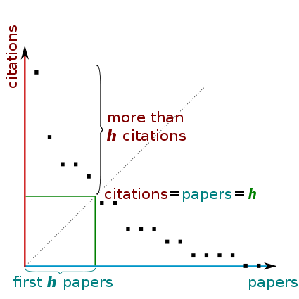

# My Algorithms Review

## Reference Books
* Cracking the coding interview(outline and summary)
* An ultimate guide to coding interview, on read.amazon.com. (outline, summay and problems)
* Coding manual by Fangqin Dai(outline and problems)
* Robert Sedgewick's Algorithms(algorithms reference)
* Introduction to algorithms(algorithms reference)
* Head first Java(language reference)
* Leetcode C++ solutions by Fangqin Dai(solutions)
* Element of Programming Interviews(EPI)(solutions)
* Leetcode OJ(problems and solutions)

## Arrays and Hash tables
### Knowledge
* Fixed size array
  * Implementation.
    * Java: Type[]. Arrays are objects. Array type inherit Object. The array's length is available as a final instance variable length. https://docs.oracle.com/javase/specs/jls/se9/html/jls-10.html
    * Python: Tuple. It's immutable static array and does not support modifiying
      elements. Supports random access as List, but membership check takes O(n).
    * JavaScript: None.
* Resizeable array
  * Performance: get, set is O(1), amortized time of add is O(1) and why. Remove an element at some position is typically O(n), but could be O(1) by switching the last element with the one to be deleted and then remove the last element. In Java, ArrayList.remove(int id) does it, and if id is the last position, it simply decrease the size counter and doesn't copy any element.
  * Implementation.
    * C++: Vector
    * Java: ArrayList.
      * It's better to use constructor to get the shallow copy of ArrayList than calling the clone method, since List interface does not have clone method.
      * When using a interface list as a parameter, it is better to use iterator to iterate it than get(id), since the latter could take O(n) time if the underlying implementation is linked list.
    * Python(all implementation here and after by default refers to CPython): list.
      CPython implements list as a dynamic array, which conforms to the performance listed here.
      * https://docs.python.org/3.7/faq/design.html#how-are-lists-implemented-in-cpython
      * https://wiki.python.org/moin/TimeComplexity?
      * https://www.laurentluce.com/posts/python-list-implementation/
    * JavaScript:
      [Array](https://developer.mozilla.org/en-US/docs/Web/JavaScript/Reference/Global_Objects/Array).
      The underlying structure is hashtable since JS Array is essentially an
      object with number-like properties.

* Hash Tables -- implementation, performance, collision.
  *  Search, insert and delete is average O(1), and we usually see them as O(1) in interview as we assume that the chance of collision is low.
  https://discuss.leetcode.com/topic/53193/are-hash-tables-ok-here-they-re-not-really-o-1-are-they/2
  * Iterating each element in it usually requires iterating each bucket, so the iteration time is proportional to the "capacity" of the HashMap instance (the number of buckets) plus its size (the number of key-value mappings). Since the load factor is a constant, iterating n elements take O(n) time, and therefore the amortized time for iterate each element is O(1)(not strictly O(1) even if no collision. Iterator() method also needs to advance the next pointer to the next element, which could check multiple empty buckets before it). As for Java HashMap, each key-value pair is wrapped in a node, and once the number of items in a hash bucket grows beyond a certain threshold, that bucket will switch from using a linked list of entries to a balanced tree. In the case of high hash collisions, this will improve worst-case performance from O(n) to O(log n). http://openjdk.java.net/jeps/180
  * LinkedHashMap.
    * It is faster at iteration and has the same time complexity for the basic operations(put, get and remove) as HashMap. Internally it uses a linked node which has before and after pointers in addition to `<key, val>` and next pointer used by HashMap.Node. The linked nodes are linked together in insertion order, and this doubly-linked list is used for iteration. (Note that get call or override the value of existing key won't change the insertion order!). Therefore, iteration over the collection-views of a LinkedHashMap requires time proportional to the size of the map, regardless of its capacity, and iterating each element takes O(1)(including getting the iterator and return the first element, which is the first inserted element -- the head in the internal linked list). However it doesn't support getting the last element in O(1) time. One workround could be caching the last element, like in "[Leetcode]Snake Game".
    * We can also specifiy access order in the constructor so that merely querying the map with get can change the iteration order too(default is insertion order). Note that TreeNode extends LinkedHashMap Node, so each bucket can also be turned into a BST, while keeping the insertion/access order through LinkedHashMap Node pointers.
    * Iteration on them often requires getting a collection view first(like calling entrySet()/values()/keySet()), which just return internal references(they are all lazy-intialization, so initial value of entrySet, values and keySet fields are null) and do not copy any data. Then we can use for-each or iterator to do the iteration, which are essentially the same. https://stackoverflow.com/questions/2923856/is-the-order-guaranteed-for-the-return-of-keys-and-values-from-a-linkedhashmap-o/2924143#2924143
    * About `protected boolean removeEldestEntry(Map.Entry<K,V> eldest)`. 'eldest' is the least recently inserted entry in the map, or if this is an access-ordered map, the least recently accessed entry. This is the entry that will be removed it this method returns true. If the map was empty prior to the put or putAll invocation resulting in this invocation, this will be the entry that was just inserted; in other words, if the map contains a single entry, the eldest entry is also the newest. This method is invoked by put and putAll after inserting a new entry into the map. If the condition in the method implementation code is satisfied, then the eldest entry will be removed. Note that in the method implementation code there could be references to variables outside the current variable inititialization.
    * Examples:
      - [Leetcode]Logger Rate Limiter. With some tests.
      - [Leetcode]Snake Game.
  * Chaining with linked lists, chaining with BST, Open Addressing with Linear Probing, Quadratic Probing and Double Hashing. (See CTCI)
  * Implementation.
    * C++
    * Java: HashMap, LinkedHashMap
    * Python: set(mutable hash table), frozenset(immutable hash table),
      dict(mutable hash map, after v3.7 it preserves insertion order). len() of
      them takes O(1):
      https://stackoverflow.com/questions/1115313/cost-of-len-function
    * JavaScript:
      * Object as hashtable
        ([ref](https://en.wikipedia.org/wiki/Hash_table#Object_representation)).
      * [Map](https://developer.mozilla.org/en-US/docs/Web/JavaScript/Reference/Global_Objects/Map).
        Not sure how it is implemented under the hood. Compared with Object, Map
        has no risk of colliding with pre-defined keys and keeps the insertion
        order (Object doesn't, e.g. when the keys are indices. The note in the
        doc says otherwise after ECMAScript 2015 which is not accurate).

* Implementation of equals and hashCode methods in Java(See *Effective Java*,
http://www.angelikalanger.com/Articles/JavaSolutions/SecretsOfEquals/Equals.html)
  * Note that if two objects are equal, their hash codes must be the same; but if two objects have the same hash codes, they don't have to be equal.
  * The hash code of Pair or unordered collection is usually implemented as sum of the hash codes of all elements.

### Problems
* [Leetcode] First Missing Positive(Algorithm* and Implementation**). Think about the O(n) space solution first and then the O(1) space solution.
* [Leetcode] Find All Numbers Disappeared in an Array(Best Algorithm*).
* [Leetcode] Find All Duplicates in an Array(Algorithm*). Similar to the previous problem. For all previous three problems, we should always think about using an extra array to store the presence of each number, then think about how to use original array to do this -- either by negation or swapping.
* [Others] Given an array of 1,000,000 integers where each integer is between 0 and 2^20 - 1, find one integer that is between 0 and 2^20 -1 that is not in the array.
Hint: 2^20 = 1,048,576 > 1,000,000. That means there are at least 48,576 integers that are not in the array.
Try to optimize time and space complexity.
  * Solution 1: using original array to see if 0 -- 999999 occur or not. Use another array of size 48576 to check if 1000000 -- 2^20 - 1 occur or not. O(2*n) time and O(48576) space.
  * Solution 2: Instead of using an extra array of 48576 to check if the rest of integers are in the array or not, we can use bitset(48576 / 32 = 1519) integers to do that, assuming each integer has 32 bits. A bit hard to code.
  * Solution 3: Use 1024 buckets to check the presence of each number. Each bucket stores the count of the numbers that fall in that range. If a certain bucket has less than 1024 count, than we can further check that range and see which one is missing. We can use the original array to do that. So O(2n) time and O(1024) space.
* K Sum problems. Can be solved using two approaches:
  * Sort the input array first. Then using two pointers starting from the beginning and the end of the array, moving one of them towards the other each time based on the comparison of the sum of the two elements and target, until they meet. The two pointers process takes O(n) time. No extra space needed, assuming sort is in place. For K > 2, always move the leftmost/rightmost pointer, and do it recursively, until the innermost two pointers which use the two pointer approach instead. Using this approach, it is easy to return unique combinations, easy but not effienct to return one solution, and hard to return complete combinations.
  * Using a hash set of combinations to record the results and remove duplicates. Sort the input array first if K > 2(this is optional and can make de-duple faster and easier to implement). Divide K into two parts first. Iterate the second part and solve the subproblem for the first part. Cache the sums and their corresponding elements at the end of each iteration. Using this approach, it is easy to return complete combinations, efficient to return one solution,  and also not very hard to return unique combinations, with additional space.

  Time complexity of k Sum problems: omega(n^ceil(k/2)), O(n^(k-1)).
  http://www.sigmainfy.com/blogk-sum-problem-analysis-recursive-implementation-lower-bound.html
  - Two sum
    - Input array is random, find out one solution.
      + [Leetcode] Two sum(Algorithm).
      + Input array is random, find out all unique solutions(Algorithm*).
      Unique: if a + b = sum, then (a, b) and (b, a) are duplicate pairs.
      Remember the clever way of removing duplicate pairs!
      + [Leetcode] Two sum II -- Input array is sorted.
        + find out all unique solutions using no additional space.
        + find out all id pairs in which the first id is smaller than the second one? The hard part is when a + b = sum, we don't know how to move the two pointers. We can move both pointers until there are no duplicates, say ia --> ia', ib --> ib', and put all pairs formed by elements between num[ia] and num[ia'] and elments between num[ib] and num[ib'] into result list.
      + [Leetcode] Two Sum III -- Data structure design.
  - Three sum
    - Input array is random, find out all unique solutions.
      + [Leetcode] Three sum(Algorithm).
      + [Leetcode] Three sum closest(Algorithm).
    - Find out the count of all triplets whose sum is less than the target:
      + [Leetcode] Three Sum Smaller(Algorithm**) Using two pointers to find out the count efficiently in linear time. Finding number of distinct triplets -- e.g. (1, 2, 3) and (1, 3, 2) are not distinct, would be harder and the runtime would be O(n^3).
      https://discuss.leetcode.com/topic/27075/what-if-the-question-is-to-find-the-number-of-triplets-instead-of-index
  - Four sum(Random input array, find out all unique solutions)
    + [Leetcode] Four Sum(Algorithms*).
    + [Leetcode] Four Sum II(Algorithm)
* Two pointers:
  The two pointer schemes in LinkedList chapter may be used, if they run in the
  same direction. Need to think carefully about the end condition in order to know which one to use!
  * Pointers moving in the opposite direction.
    This can often reduce runtime from O(n^2) to O(n). It basically tries to check the two elements pointed by the pointers against some condition and moves left pointer to the right or right pointer to the left accordingly, to skip some unnecessary comparisons and narrow down the search range. Optionally we can skip duplicate elements at the beginning of each iteration.
    - [Leetcode] Previous three sum problems.
    - [Leetcode] Container With Most Water(Algorithm)
    - [Leetcode] Trapping Rain Water(Multiple Algorithms** and implementation of best solution*)
  * Pointers moving in the same direction, on different lists.
    Same as previous, this essentially skips unnecessary comparisons and narrow down the range of comparison.
    - [Leetcode] Intersection of Two Arrays I and II(Algorithm when the arrays are sorted*). Remember the proof.
    - [Leetcode] Shortest Word Distance II(Algorithm*). O(1) get solution will TLE due to the lone pre-processing time. Remember the acceptable two pointer solution, and its proof.
  * Pointers moving in the same direction, on the same list.
    Works as if the faster pointer is copying data to another list. Need to know why it is not affected by overriding.
    - Remove duplicates(Maximum allowed duplicates == K). Two ways of checking duplicates!
      * [Leetcode] Remove Duplicates from Sorted Array(Best Algorithm*).
      * [Leetcode] Remove Duplicates from Sorted Array2(Best Algorithm**). Remember the prooves for solutions to both problems.
    - [Leetcode] Move Zeros(Algorithms*). Remember both algorithms and how to prove them!
  * Pointers moving in the same direction on the same list, all elements in between are considered.
    The main loop moves the faster pointer and check each meaningful substrings ending with the faster pointer, and for each iteration, keep moving the slower pointer until some condition is met. Usually needs to maintain a max/min value and return it.
    This essentially skips some unnecessary checks of elements between certain pairs of pointers, which is mainly done by the inner loop -- subarrays/substrings starting with the slower pointer is skipped, and we only need to compare the subarrays/substrings between the slower pointer and the faster pointer, not all elements before the faster pointer. So the loop invarient at the beginning of each iteration is usually the subarrays/substrings ending with elements before current fast pointer are all checked, and subsequent checks do not need to compare subarrays/substrings starting with elements before slow pointer -- (slow pointer, fast pointer) is the first subarray/substring that is valid ending with fast pointer.
    Usually needs to maintain a map of char to its counts for chars in [leftPointer, rightPointer). The number of chars between them can be obtained by rightPointer - leftPointer.
    Becareful about the position of calculating max/min values! Very error-prone and hard to find out the problem!
    - [Leetcode] Minimum Size Subarray Sum(Algorithms* and implementation of two pointer solution**). Sometimes the max/min value should be initialized failure value, not Integer.MAX_VALUE or Integer.MIN_VALUE, because it is likely those values are confused with some valid max/min values. The code is not that complicated for the update part -- one line is enough.
    Note that the assuption of positive nums are important! Otherwise this two-pointer solution must be modified, and the runing time will has to be O(n^2) at best(proof?). And because of this assumption, the question makes sense asking the "minimum" size, not the "maximum" size. And similar questions like "finding maximum size subarray whose size is no larger than k" can also be solved similarly.
    - [Leetcode] Longest Substring Without Repeating Characters(Implementation*)
    - [Leetcode] Longest Substring with At Most K Distinct Characters(Algorithm*)
    - [Leetcode] Longest Substring with At Least K Repeating Characters(Multiple Algorithms*, one of them is two pointer**)
    - [Leetcode] Minimum Window Substring(Algorithm* and best implementation**). Remember the one map implementation. Also recording the indices is better than recording the substring.
    - [Leetcode] Permutation in String(Algorithms** and implementation of two pointer solution**). Similar to above, can also be solved using one hashmap. Code is slightly different. But some implementation tricks can still be used(see code comments of Minimum Window Substring)
    - [Leetcode] Substring with Concatenation of All Words(Algorithm* and Implementation**, very hard). In this question, word list can contain duplicate word, and the target substring should contain exactly same number as appeared in the word list. Might be easier to implement if before each scan, do a pre-processing and get list of words.
* [Leetcode] Shortest Word Distance(Algorithm*). It looks similar to another problem, but I forgot which one.
* [Leetcode] Shortest Word Distance III(Algorithm*). A follow-up of above. Easy to make mistake here!
* Subarray sum problems. Three approaches:
  * DP. If the problem asks for max/min sum and there is no more constraint on it.
  * Two pointers.
    - [Leetcode] Minimum Size Subarray Sum(See previous).
  * Get accumulative sums first. This could be sorted in some cases. But usually we need to iterate on it while maintaining some kinds of maps. If order won't be changed, accumulative sums can be calculated on the fly instead of using additional array to store them.
    - [Leetcode] Maximum Size Subarray Sum Equals k(Algorithm**). Question could ask for minium size instead, which can also be handled similarly.
    - [Lintcode] Subarray Sum Closest(Algorithms**). Remember both solutions. Also note how useful a treemap is when getting the closest key instead of an exact key. If the questions asks for the minium length of subarray that has sum closest to k, it can still be solved with a few modifications.
    - [Lintcode] Submatrix Sum(Algorithms**). Remember how to enumerate all the sub rectangles in a 2D matrix. Remember the trick to add padding zeros. Hard to come up with the trick to reduce the 2D space usage to 1D!
    - [Leetcode] Max Sum of Rectangle No Larger Than K(Algorithm*). Extension of above.
* [Others] Task schedule with cool down(Algorithm and implementation**).
* [Leetcode] Product of Array Except Self(Algorithm**). Divide, compute one side and store it, then compute another side. Can be applied to many other problems.
* [Leetcode] Increasing Triplet Subsequence(Algorithm**). This can also be solved using idea similar to the previous problem, but it would use O(n) extra space. The best solution can also be applied to checking the existence of increasing subsequence of any length. Useful trick and can be applied to other problems.
Trick: When finding max/min element, we can either use reference type variable instead of primitive type so that we can use null as the initial value, or use index of the element and -1 as the initial value(or any special value indicating invalid for the element). The latter ways may require slightly more code when update. Both ways are preferable to using primitve type and Integer.MAX_VALUE/Integer.MIN_VALUE as the initial value, since the latter way cannot return a reasonable value when there is no max/min value found(latter way works well only when the max/min value is guaranteed to exist). Or if the logic is simple, we can use the first element as initial value.
* [Leetcode] Longest Consecutive Sequence(Algorithms**). Remember the trick that processes each streak in an inner loop at the beginning of each streak, which still takes linear time overall.
* [Leetcode] Bomb Enemy(Best algorithm**). Remember the implementation of dealing with streaks/chunks, which is similar to previous problem. An alternative is to process each chunk and moves on to the next chunk immediately, which is less flexible and cannot be used as caching.
* [Leetcode] Majority Element(Best algorithm**).
* [Leetcode] Rotate Array(Algorithms**).


## Strings

### Knowledge
* JAVA: String, StringBuilder and char[].
  * StringBuilder is essentially a wrapper of dynamic char array , and append(string) basically copy each character from input string to the end of existing char array. When deleting, it will shift the characters after those deleted forward. To remove the last element in the StringBuilder, just use sb.setLength(sb.length() - 1). toString () method returns a copy of wrapped char array, wrapped by a newly created String. setCharAt(index, char) is also an useful method to update a certain char in the StringBuilder. Also note that StringBuilder doesn't have isEmpty() method while String does.
  * char[] array usually has a better performance than StringBuilder since it is simpler. But when dynamically adding new elements to it, usually another variable charLen is needed to record the current length(number of filled elements in the array). Creating a string from it is simply using new String(char[] value, int offset, int count). char[] can make backtracking easier since you can just override the old elements when searching a new branch. But StringBuilder is also useful and saves you from maintaining the length of the array.
  * If we have to keep inserting strings/chars to the front, there is a better way -- append the strings/chars to the end and at last call StringBuilder.reverse(). This can make the code run in O(n) time instead of O(n^2) time.
* Palindrome.
  * Definition. A string that reads the same backward as forward, e.g., madam.
  Checking if a string is a palindrome can be easily done in O(n) time. And so is checking if a linked list a palindrome, which can also be done using O(1) space if reversing the first/second half of the original list is allowed.
  * Check if concatenation of two strings is a palindrome.
    - The reverse of the second string has to be the 1)the prefix of the first string, and the rest of the first string is a palindrome, or 2)the first string is the prefix of the reverse of second string, and the rest of the reversed string is a palindrome. [Leetcode]Palindrome Pairs. Trie approach.
    - Choose the longer(or equal) one s1, the other is s2. If s2_reverse is the prefix of s1, and the rest of s1 is a palindrome, then s1s2 is a palindrome. Otherwise if s2_reverse is the suffix of s1, and the rest of s1 is a palindrome, then s2s1 is a palindrome. When s1.length == s2.length, the concatenation is a palindrome when and only when s2_reverse == s1. [Leetcode]Palindrome Pairs. Hashmap approach.

  * Find out all the palindrome substrings. There are two ways to do this, which are very useful when solving more complex palindrome related problems. Both ways take O(n^2) time, n is the length of string s.
    * Search all the substrings and check if each of them is palindrome. Has to use addition space.
    Let f[i][j] indicate whether substring s[i...j] is a palindrome or
    not. Iterate the string from right to left, for each character s[i], check
    all substrings s[i..j], i <= j < s_length. `f[i][j] = (s[i] == s[j]) && (j - i < 2 || f[i+1][j-1]))`. f[i][j] can be reduced to 1D if j starts from s_length - 1. Remember!
    * Search the substrings with each possible center. Doesn't check all substrings but just those that are likely to be a palindrome. If we only want to iterate all palindrome substrings but not store them, this approach uses O(1) space. So this is more efficient in both time and space.
    Iterate the string from left to right. For each character s[i], check
    the substrings that center at it of odd and even lengths.
    ```java
      for (int i = 0; i < s.length(); ++i) {
          //Odd length.
          for (int j = 0; i-j >= 0 && i+j < len && s.charAt(i-j) == s.charAt(i+j); ++j) {
              f[i-j][i+j] = true;
          }
          //Even length.
          for (int j = 0; i-1-j >= 0 && i+j < len && s.charAt(i-1-j) == s.charAt(i+j); ++j) {
              f[i-1-j][i+j] = true;
          }
      }
    ```
    Example: [Leetcode] Palindrome Partitioning II.
  * Finding the longest palindrome starting from a certain letter in a string
  can be solved in O(n) time and O(n) space using KMP pre-processing algorithm(after appending a non-existent character and the reverse of original string to it). No need to know the implementation details, but need to know the time and space complexities of KMP. The actual string matching part of KMP takes O(m) time, where m is the length of the string being matched. So the totol time is O(m + n). --- [Leetcode]Shortest Palindrome.
    * KMP algorithm has two parts --- pre-computing part and actual string matching part. Inputs are two strings, text string(T of length n) and pattern string(P of length m). The pre-computing part takes only the pattern string and output an array &pi; of same size.
    &pi;[i] is the length of longest prefix of P that is also the suffix of P[0..i].
    No need to know how to implement KMP and other advanced algorithms. I think it's enough to know the time complexities of them. See more in *Introduction to Algorithms*
* Anagram: a word, phrase, or name formed by rearranging the letters of another, such as cinema, formed from iceman. To check if two strings are anagrams, either use a hashmap to count the number of occurences for each character and compare them, or just sort the two strings and see if they are the same.
* Don't forget the edge case when the string is empty! If this happens, for loop on the string won't happen!
* Note that the whitespace in a string may not be ' ', could be '\t' or even '\n'.
* Terminology: '{' --- brace, '[' --- bracket, '(' --- parenthesis.

### Problems
* Numbers related
  Pay attention to how to handle substrings starting with 0, like '0001'.
  - [Leetcode] Integer To Roman(Algorithm*)
  - [Leetcode] Roman To Integer(Algorithm*)
  - [Leetcode] Integer to English Words(Algorithm* and Implementation)
  - [Leetcode] Basic Calculator II(Best Algorithm** and Implementation). Remember the best algorithm, which can be applied to many other problems. Also remember the way how to get integers formed by a substring without using Integer.parseInt(string). In interview, give the stack solution first and then improve it to get the best solution!
  - [Leetcode] Valid Number(Algorithm* and Implementation*). The decription is vague, so refer to the comments in my Java solution for detailed requirements.
* Palindrome related:
  - [Leetcode] Palindrome Permutation(Best Algorithm*)
  - [Leetcode] Shortest Palindrome(Best Algorithm***). Naive O(n^2) solution should be enough.
  - [Leetcode] Palindrome Pairs(Multiple Algorithms** and Implementations**).(Distinct indices (i, j) just means that i != j) One way to improve the speed of not optimal algorithm is consider caching some values when building the trie. Remember the edge cases for the second approach.
* Anagram related.
  - [Leetcode] Group Anagrams(Algorithms*). The key is to find out how to uniquely represent the anagrams. The robust way is to use the sorted string, but in some cases the counting array, or even the product of prime numbers could work too.
* Parsing.
  Processing substring using an inner loop is usually a robust way. If this is done for certain characters only, consider doing it when only that condition is satisfied. An alternative way is do this for any case and break out when the condition is not satisfied and then continue handling other cases in the same iteration. The latter way might be simpler but requires more thought and could be less robust if different cases require different handling. So try the former way to be on the safe side.
  - [InterviewBit] Pretty Json(Best Algorithm** and Best Implementation**). Remember the best implementation logic. Also the edge case when '}' or ']' is followed by ','. For this recursive-like parsing problems, stack is often needed if the previous context value cannot be restored. But for this problem the previous value can easily be restored so using just a variable to store the current context value is enough.
  The Json value could be a string, number, null, another json object, or an array object. The Json object is comprised of key-value pairs, while the array object is comprised of values. This problem just involves four cases as is shown in the code.
  - [Leetcode] Text Justification(Best Implementation**). We can assume the words are non-empty since they are usually the output of split on the original text string. Pay attention to the case when there is only one word in the line, and the last line.
  To deal with each group of elements in an array, one good implementation is to use a inner loop to iterate the elements of each group. This makes it cleaner to do pre-processing and post-processing of each group.

## Linked List

### Knowledge
* Java: LinkedList class -- doubly linked list, performance
* Two pointers technique is frequently used! The diff between any two given linked list can always be found in O(m+n) time. Also we can use two pointers to find the middle node, or the last node of first half, by using one slow and one faster pointer, without dummy head. Remember the implementation.
Two pointers iteration on two linked lists(one on each of them):
  ```java
  while (p != null || q != null) {
    if (p == null) {
        operation on q;
        q = q.next;
    } else if (q == null) {
        operation on p;
        p = p.next;
    } else {
        operation on both p and q(might have more branches here)
        p = p.next;
        q = q.next;
    }
  }
  ```
  ```java
    while (p != null && q != null) {
        operation on both p and q.(might have more branches here)
        p = p.next;
        q = q.next;
    }
    /*while (p != null) {
        operation on p.
        p = p.next;
    }
    while (q != null) {
        operation on q.
        q = q.next;
    }*/
    //another way
    v = p != null ? p : q;
    while (v != null) {
        ...
    }
  ```
This approach is preferable if we can skip iterating the non-null list after the loop breaks. E.g. merge two sorted linked lists.
(probably best):
  ```
  while(p != null || q != null) {
      if (p != null && (q == null || condition_of_iterate_p)) {
          operation on p.
          p = p.next;
      } else {
          operation on q.
          q = q.next
      }
  }
  ```
The above implementations can also be appied to two pointers iteration on arrays or strings. E.g. The merge function of Merge Sort.
* Sometimes we can use the input pointers to reduce the number of pointers created. It is possible to delete a node only by using that pointer if that node is not the head or tail --- by shifting the contents of the following nodes toward it and remove the last one.
* Adding dummy node to the front a linked list can be convenient for iterating over the list using two pointers, especially if we want to remove the first node, or insert in front of the first node. It also helps when there is cycle in the linked list and the cycle starting point if the head of linked list. New head is always dummy.next, not neccessary the original head! Think carefully about edge cases involving the head node if we do not want to add the dummy node(for node finding problems, think about the case when there is only one node in a list).
* When iterating a linked list, just use preNode if you could insert another node into it.
* Edge cases: (think normal case first), insert/remove the first/last node, one node linked list, null list.
* Three approaches for reversing linked list and their implementation(see below). Use previous node pointer instead of the current node pointer if we want to move the current node around or remove a node.

### Problems
* Node finding.
  - [Leetcode] Intersection Of Two Linked Lists(Best Algorithm* and Best Implementation*). Remember this algorithm(including the first trial) and the edge case when one linked list is null.
  - [Leetcode] Linked List Cycle II(Algorithm** and Implementation*). Remember the test cases too.
* Remove nodes:
  - [Leetcode] Remove Nth Node From End of List(Implementation, practice dummy node, two pointers moving and edge case thinking)
  - [Leetcode] Remove duplicates from sorted list I(easy) and II(Implementation*).
  - Generalization of I to allow K duplicates -- Remove duplicates from sorted list III.(Best Implementation**). Not found in any OJ. I implemented the test cases.
* Reverse nodes:
  * Basic head insertion(Iterative and recursive) -- creating a new linked list, original head pointer will become tail pointer, and the new head pointer keeps updating. No need for the dummy node.
    - [Leetcode] Reverse Linked List(Implementation, recursive algorithm*)
    - [Leetcode] Palindrome Linked List(Algorithm).
  * Head insertion for reversing sublists -- This process includes node removing and node insertion. Must add dummy node. The predecessor of the head of the original sublist now becomes the predecessor of the tail of the reversed sublist. So the predecessor of each sublist is enough to reverse the sublist and get the new head and tail of the reversed sublist. Note that we can either insert each node to the original list, or insert them into a temporary sublist and then insert it back. The former way requires more than 1 node in each sublist, but the latter way doesn't require that. See solution for 'Reverse Linked List II'.
    - [Leetcode] Swap Nodes in Pairs(Implementation)
    - [Leetcode] Reverse Nodes in K-Group(Algorithm* and Implementation*)
    - [Leetcode] Reverse Linked List II(Implementation*)
  * Tail insertion(can be skipped). Inserting each node right after the original tail node. Need to first aquire pointer to the tail node and then start from the first node. Original tail node will become new head node. Pointer to the sucessor of the original tail node need to be stored or it will be lost.
    - [Leetcode] Reverse Nodes in K-Group(Algorithm* and Implementation*)
* Re-arrange nodes:
  Removing nodes first, and then either insert them into the original list or a new list. The latter way requires creating a new dummy node and tail node for appending, more nodes than the former way but could be simpler. The former way need to deal with some special cases, like removing and inserting into the old place, which could affect the next position of the pointer.
  - [Leetcode] Rotate List(Algorithm**, practice two pointers moving--two ways)
  - [Leetcode] Partition List(Best algorithm*)
* Copy linked list:
  - [Leetcode] Copy List with Random Pointer(Algorithm*, two approaches)


## Stack and Queue

### Knowledge
* A stack can be implemented with a resizable array or a linked list; A queue can be implemented with a cyclic array, double resizeable arrays or a linked list.
* Java implemenation:
Interfact Deque<E>, push(E item), pop(), peek().
Interface Queue<E>, offer(e), poll(), peek().
Iteration using iterator and Deque.descendingItarator -- same usage, but opposite iterating order.
Both of them can be implemented as class ArrayDeque<E>, which is essentially a cyclic array implemented with a resizable array. According to java doc, "This class is likely to be faster than Stack when used as a stack, and faster than LinkedList when used as a queue". The Deque interface usually doesn't allow null element, as peek() returns null when the deque is empty, not throwing any exceptions. However LinkedList does allow null element. Stack interface permits null element too. However try not to put null element in any case.
Java ArrayDeque can be used to implement monotonic queue(see [Leetcode]Sliding Window Maximum). Note that peek(), poll(), push() and pop() are all performed on the head of the queue. offer(), peekLast(), pollLast() are performed on the tail.
* In some design problems, sometimes it is good to call peek() first in pop()/poll().
* Queue can be used to implement cyclic iteration with conditional removal. -- [Leetcode] Zigzag Iterator. If there is no removal, this can be done simply by using a index, or a iterator.

### Problems
* [Leetcode] Simplify path(Implementation*)
* [Leetcode] Evaluate reverse polish notation(Implementation)
* [Leetcode] Min stack(Multiple algorithms*, one stack solution is not really good).
* [Leetcode] Implement queue using stacks(Algorithm)
* [Leetcode] Implement stack using queues(Best Algorithm**)
* [Leetcode] Largest Rectangle in Histogram(Algorithm** and implementation*). Remember the progression and think of loop invarient to prove the correctness.
* [Leetcode] Sliding Window Maximum(Algorithm** and Implementation).
* [Leetcode] Exclusive Time of Functions(Algorithm**). Pay attention to the corner cases.

## Tree
### Knowledge
* Definition of tree, binary tree and binary search tree, and the differences between them. For BST, definition can vary slightly with respect to equality, if there could be duplicate values.
* Balanced vs Unbalanced.
  * Definition of balanced binary tree:
    An empty tree is height-balanced. A non-empty binary tree T is balanced if:
      * Left subtree of T is balanced
      * Right subtree of T is balanced
      * The difference between heights of left subtree and right subtree is not more than 1.
    E.g. [Leetcode]Balanced Binary Tree.
  * Two common types of balanced (binary search) tree are red-black tree and AVL tree. Usually the height of a balanced BST is O(log(N)). Search, insertion and deletion all take O(logN) time. Java implementation: TreeMap, based on red-black tree.
* Definition of complete, full and perfect binary trees.
* Number of nodes in perfect binary tree: n = 2^k - 1 (k is the number of levels)
* Binary tree inorder, preorder and postorder traversal and their three implementations (see related problems below, remember the implementation of them except Morris). --N-ary trees?
Also finding the predecessor and successor is easy when the tree node has parent pointer. If not, then we have to use traversal and save the current visited node. Make sure you know how to do it both iteratively(easier) and recursively(know how to pass previous visited node to the recursive function and how to return correctly).
Example: [Others]InorderSuccessorBinaryTreeWithParent and without.
* About Morris traversal: the basic idea is to use null right child of some nodes to store the succedents beforehand and delete them afterhand. Preorder and inorder are similar, since the right children are always traversed at last, and therefore after traversing back through the thread pointer there is no need to visit the left children again. However for postorder traversal, the parent node is traversed at last. So after traversing back through the thread pointer, the left children have to be visited reversely(only those nodes from the direct left child all the way down to the right). It is also necessary to create a dummy node and(7) have its left child be the root.
* If the problem is about the height(distance from the furthest leaf to the current node), consider to compute the height for each node recursively, based on that of its children(this is essentially bottom-up recursion). Consider treating null as height -1. E.g. [Leetcode]Find leaves of binary tree. This solution can be applied to finding height of all the nodes.
For depth(distance from the root to the current node) related problems, if the problem asks for depth of each node, then we have to use top-down recursion. If it asks for max/min depth of a binary tree(max/min distance from the root node to a leaf), then the problem can be converted into finding max/min height of root node, and it's better to use bottom-up recursion than top-down recursion since the latter would require passing a global variable to the recursive function). However if using iterative solution, top-down is easier to implement than bottom-up.
Note that the bottom-up recursion code of finding the minimum height/depth is more complex than finding the maximum(technically they should not be called at height/depth)! For the minimum, usually if one of them is null, we take the height/depth of the other, otherwise we use the minium one plus 1. E.g. [Leetcode]Minimum Depth of Binary Tree
Besides traditional resursive approach, max-depth problem can also be solved by removing the leaf nodes in each iteration until the tree is empty. E.g. [Others]Find Depth.
* Binary search tree:
  * Definition: A binary search tree (BST) is a binary tree where each node has a Comparable key (and an associated value) and satisfies the restriction that the key in any node is larger than the keys in all nodes in that node’s left subtree and smaller than the keys in all nodes in that node’s right subtree. So the values in each subtree is within a range, which can often be used in a recursive function to solve many BST problems(use reference type in the range since the range is often exclusive). E.g. Validate BST, Serialize and Deserialize BST.
  * Ascending order when doing inorder traversal on it.
  * Search, Minimum, Maximum, (inorder)Successor, (inorder)Predecessor  operations all run in O(h) time. h is the height of the BST. See the Leetcode practices for Successor implementation.
  * Insertion(easy) and Deletion(harder, see one example problem) also runs in O(h) time.
  * Selection and Rank. See Leetcode problem below.
  * Range query -- finding all elements in a BST that have values within a given range. See Robert's Algorithms. O(n) time and O(h) space. Can be solved both iteratively or recursively. Recursive solution that has target range as one parameter of the recursive function can avoid iterating out-of-range nodes.
  * Implementation. Java: TreeSet/TreeMap, balanced BST(red-black tree). It provides guaranteed log(n) time cost for the containsKey, get(give key or first/last key), put and remove operations. NOTE: BST usually doesn't allow duplicates. Workarounds for it are either store map of node to counts, or use more complex keys.
* Trie(Prefix tree/radix tree/digital tree):
  * Refer to Robert's Algorithms. Think of the chars on the link instead of on the node.
  * The map in each node can be implemented with hashmap or array.
  * See the first two leetcode problems for complete implementation of trie methods.
  * The value of each node can be boolean, integer, or even a String -- representation of the word from the root to the node. And this value can change and be used for de-duplication. E.g. [Leetcode] Word Search II.

### Problems
* Traversal
  Make sure to understand the process of three basic traversals.
  Code usually can be proved inductively -- properties of each subtree are maintained and passed to the parent tree. See solutions of postorder traversal.
  Tree problems can often be solved by recursion. DP rarely works. The recursion could be either top-down or bottom-up, or both.
  - Basic Traversals.
    + [Leetcode] Binary tree inorder traversal(Algorithms* and Implementation*). Recursive solution, typical iterative solution using a stack, Morris Traversal(rarely used). Step by step version: [Leetcode]Binary Search Tree Iterator.
    + [Leetcode] Binary tree preorder traversal(Algorithms* and implementation*). Recursive solution, typical iterative solution using a stack, iterative solution applicable to n-ary trees, Morris Traversal(rarely used). In the typical iterative solution for preorder and inorder traversals, at the beginning of each iteration, the stack contains the ancestors of current element such that the current element is in the left subtree of each one of them. This is an important loop-invariant that might be helpful sometimes!
    + [Leetcode] Binary tree postorder traversal(Algorithms** and implementation**), it can be seen as a reverse of preorder traversal. Hardest among the three. Recursive solution, typical iterative solution using a stack, iterative solution applicable to n-ary trees, Morris Traversal(rarely used).
    The recursive solutions to many other problems can be converted into iterative one by storing the computed result for left and right child of the current node, usually in a map. After storing the computed result for the current node, the results for its children can be discarded.
    + [Others] Find in-order successor of node in binary tree using parent pointer(Algorithm and implementation).
    + [Others] Find in-order successor of node in binary tree without using parent pointer.(Implementation of recursive solution)
    + [Leetcode] Flatten binary tree to linked list(Multiple Algorithms**)
    + [Leetcode] Path Sum I(Implementation). Problems with target sum that requires recursion can often pass remaining sum as a parameter instead of target sum and current sum. This trick can be applied to many other problems with target sum!
    + [Leetcode] Path Sum II.
    + [Leetcode] Path Sum III(Algorithm**). Remember the top-down way of enumerating all the path with target sum! Passing the total count as a parameter may be easier to think of, which can be improved to change to the return value of the recursive function, if the count is used in post-order way.
    + [Leetcode] Lowest Common Ancestor of a Binary Tree(Algorithms*). If the question asks to return special value when not both of the input nodes exist in the tree, then the recursive function should return not only a node, but also the number of found nodes.
    Building a map of node to its parent node while traversing the tree is a great trick that can be applied to some other tree problems.
    + [Others] Lowest commmon ancestor of deepest nodes(Best algorithm** and best implementation**). Remember the recursive thinking of LCA algorithms.
    + [Leetcode] House Robber III(Algorithm*)
    + [Leetcode] Binary Tree Paths(Implementation). Remember the worst case and time complexity analysis of this kind of problem.
    + [Leetcode] Boundary of Binary Tree(Best Algorithm** and best implementation*). Clarification: Root node can be counted as left or right boundary node. When root.left != null, the path from the root to the left-most node is the left boundary, otherwise there is no other left boundary node. Similar for the right boundary nodes, which only have more than one node when root.right != null.
    For this kind of reverse traversal problem, remember try some post-order approach. The best implementation may not be easily come up with at the beginning. It's okay to write two functions first and then consolidate them later.
    The iterative solution for the two functions version is easy to implement since they are all pre-order traversals. But need to add a map of node to the flag.
  - Level order traversal related.
    + [Leetcode] Binary tree level order traversal I(Multiple algorithms*), II is just adding reverse to the end of the solution of I. The recursive algorithm can be applied to some other problems.
    + [Leetcode] Invert Binary Tree. Can be solved both recursively and iteratively. Just for fun.
    + [Leetcode] Zigzag level order traversal. Reverse the array for that level every two levels(or assign the values reversely when creating the array for that level).
    + [Leetcode] Binary Tree right side view -- small variation of level order traversal.
    + [Leetcode] Symmetric Tree(Algorithm and Multiple Implementation*). Iterative solution using queue or stack can add the elements in any order.
    + [Leetcode] Populating next right pointers in each node I and II(Implementation**). Remember the branching logic.
    + [Leetcode] Binary Tree Vertical Order Traversal(Algorithm*). When implementing level order traversal, sometimes it is easier to handle the current node directly instead of handle the left and right node respectively. Also remember the trick to iterate keys in sorted order without using sorted map/set in linear time.
  - Depth/height related.
    + [Leetcode] Find leaves of binary tree(Algorithm** and Implementation). When requiring return a list of nodes that does not follow the order of basic traversal, consider storing the element directly to the corresponding location in the output array.
    + [Leetcode] Minimum Depth of Binary Tree(Algorithms and Implementation)
    + [Leetcode] Balanced Binary Tree(Best Algorithm*)
    + [Leetcode] Diameter of Binary Tree(Algorithm*)
* Recontruction of binary tree:
  - [Leetcode] Construct Binary Tree from Inorder and Postorder Traversal (Algorithm*), and Construct Binary Tree from Preorder and Inorder Traversal (same). Cannot construct the binary tree from Preorder and Postorder(why? When coming up with exceptions, try starting with the simplest examples) Note that if duplicates exist in the input array, there may not be unique tree!
  - [Leetcode] Serialize and Deserialize Binary Tree(Algorithms** and implementation*)
* Binary Search Tree:
  - [Leetcode] Validate Binary Search Tree(Multiple algorithms* and Implementations*) -- this reveals an important attribute of BST when traversing it!
  - [Leetcode] Recover Binary Search Tree(Algorithm and Implementation*). Note that this question assumes there are no duplicates in BST! What would be the solution if there could be duplicates?
  - [Leetcode] Inorder Successor in BST(Algorithm*). This algorithm uses the ascending order attribute of BST so that it can run in O(h) time not in O(n) time. Therefore this algorithm works only when the target is INORDER successor and there are no duplicates in the tree. If duplicates are allowed, this algorithm can not gurantee that the node returned is INORDER successor. Example:
      ```
            13 (actual returned node)
          10
        9
          10 (look-up node)
            10 (expected returned node)
      ```
    This algorithm can be easily extended to implement Ceiling and Floor methods. Remember the inductive proof from the root.
  - [Leetcode] Convert Sorted Array to Binary Search Tree(Algorithms and Iterative Implementation*)
  - [Leetcode] Convert Sorted List to Binary Search Tree(Best Algorithm* and Implementations*), constructing tree from array can also be solved by bottom-up approach!
  - [Leetcode] Delete Node in a BST(Best Algorithm* and Implementation)
  - [Leetcode] Kth Smallest Element in a BST(Multiple Algorithms*)
  - [Leetcode] Lowest Common Ancestor of a Binary Search Tree(Algorithm*)
  - [Leetcode] Serialize and Deserialize BST(Algorithm** and implementation**). Remember the algorithm and implementation. Be careful about the integer pointer!
  - [Leetcode] Verify Preorder Sequence in Binary Search Tree(Best Algorithm**).
  - [Leetcode] Skyline Problem(Best Algorithm** and implementations**). Remember the two ways of implementing BST multi-map/set. They are equivelent in logic, so don't hesitate to use them exchangely.
* Trie
  - [Leetcode] Implement Trie (Prefix Tree)(Full Implementation*, recursive solution of delete?)
  - [Leetcode] Add and Search Word - Data structure design(Implementation)
* Others
  - [Others] Find Depth. (Algorithms* and implementations*).

## Graph
### Knowledge
* Representations(Refer to CTCI)
  * Adjacency list. V(number of Vertices) + E(number of edges) space for directed graph, or V + 2E for undirected graph. This is usually the preferred representation. Works well when accessing the neighbors is frequent. For fast edge lookup, just use hashset of integers(instead of list) as the element of arrays in the Graph class(Refer to the implementation of adjacency list in Robert's Algorithms). The list can be implemented with a HashMap or ArrayList(the latter can handle most of the porblems, so think of it first). The former works better if the graph is sparse or the key is not easily mapped to an integer. However need to know that when creating the map, if the graph is directed, the node without outbounding edges will not be inserted. So when getting the adjacent elements of a node, first check if the corresponding adjacency list in the map is null! Or better simply make sure all the nodes are inserted.
  * Adjacency matrix. V*V space. Fast for edge lookup, easier to represent weights, but usually takes more space than adjacency list. And has no way to represent parallel edges.
  * Properties. A free tree(usually just referred as 'tree') is a connected, acyclic, undirected graph. Let G = (V, E) be an undirected graph. The following statements are equivalent.
    - G is a free tree.
    - Any two vertices in G are connected by a unique simple path.
    - G is connected, but if any edge is removed from E, the resulting graph is disconnected.
    - G is connected, and |E| = |V| - 1.
    - G is acyclic, and |E| = |V| - 1.
    - G is acyclic, but if any edge is added to E, the resulting graph contains acycle.
    => Leaves(vertices that have degree 1) must exist. Otherwise you can always traverse from one vertix to another and sooner or later you'll have to go back to a vertic that has been visited, since the number of vertices in a graph is limited. Then there would be a cycle. See more proof in CTCI, B.5.1. Remember these equal properties and their prooves. Basically, to keep n vertices connected, there must be at least n-1 edges. Proof: Let's take a look at one of the vertices v1. If the graph is connected, then there must be a path from v1 to any of the other vertices. The current connected component K_v = {v1}. Edge set is K_e = {}. Say v2 is connected to S, then there has to be at least one more edge between v2 and S(say e2), then the connected componet is: K_v = {v1, v2}, K_e = {e2}. K_e always has the least number of edges that connect the vertices in K_v, and after the last vertex, there must be n - 1 edges in K_e, which is the least number of edges that connect the n vertices.
    NOTE: The above properties do not necessary work for directed graph! Especially the relation between number of edges and vertices. A digraph can contain more than |V| - 1 edges and still no cycles!
* Traversal. Don't forget null input node and loops! Also note that the following pseudocode only implements traversing from one node. If the graph is not connected, then DFS and BFS below must be called for each node!
The following template is just used for implementation. Think about the problem itself when considering the algorithm -- like what parameters to use in the recursive functions and what they do in each recursion. For backtracking problems, think about if the entry point is one point or multiple first!
  * DFS. Can be used for counting the number of connected components in a graph, check if two vertices are connected, etc. Implemented recursively. Iterative solution usually uses a stack(of actual element or iterator of lists of elements. Often used as step-by-step backtracking and implementing iterators. E.g. [Leetcode]Flatten Nested List Iterator). And a map of node to its parent can be created while traversing to retrieve the paths.
    - Search all nodes in a graph. DFS will search all the nodes and only once for each one, because in each iteration/recursion all the possible neighbors are checked and we only go to the unvisited node in the next iteration/recursion. This is often used to traverse all the nodes in a connected component.
      + Implementation 1:
        ```
        DFS_Recursive_Main(node):
          if node is null, return;
          visit(node);
          visited[node] = true;
          DFS(node, visited);
          Done;

        DFS(node, visited):
          for (adjNode : node.adjNodes) {
              if (visited(adjNode) == false) {
                  visited[adjNode] = true;
                  visit(adjNode);
                  DFS(adjNode, visited);
              }
          }
          Done;
        ```
      + More popular implementation, very suitable for grid based problems:
        ```
        DFS_Recursive_Main(node):
          DFS(node, visited);
          Done;

        DFS(node, visited):
          if (node is visited or not valid) {
              return;
          }
          visited[node] = true;
          for (adjNode : node.adjNodes) {
              DFS(adjNode, visited);
          }
          Done;
        ```
    - Finding all the paths between two states(backtracking).
      + When starting from a single node. E.g. [Leetcode]Word Search.
        ```
          main:
            //Initialize the capacity of curPath if possible!
            DFS(node, 0, curPath, paths, visited);
            return paths;

          //curPath store previous visited nodes
          DFS(node, startId, curPath, paths, visited):
            if end state {
                paths.add(curPath.shallow_copy);
                return;
            }
            if current state is not valid {
                return;
            }
            visited[node] = true;
            curPath.add(node);
            for (adjNode : node.adjNodes) {
                //Be careful about newStartId!
                DFS(adjNode, newStartId, curPath, paths);

            }
            visited[node] = false;
            //If using Java StringBuilder, try sb.setLength(originalLen)
            //or sb.setCharAt(id, newChar) to change directly
            curPath.remove(node).
            Done;
        ```
      + When starting with a range. This seems to be the dominant type. The parameters must include all the necessary info that determines the next states. Usually id is one of them, like id of an array or string, which could be change if the string itself change(E.g. [Leetcode]Remove Invalid Parentheses). When debugging it is often necessary to print these parameters out for each recursive function.
        ```
          main:
            DFS(states, 0, new ArrayList<>(), paths, visited);
            return paths;

          //curPath stores all the valid elements up to now,
          //not including any of of current states
          DFS(states, startId, curPath, paths, visited):
            if (startId > limit) {
                paths.add(curPath.shallow_copy);
                return;
            }
            //Pruning can be added here
            if (other checks are not passed) {
                return;
            }
            //Pruning can also be added here to reduce the number of adjacent
            //states
            for (sub_states : states) {
                //We often must do the validation here instead of at the
                //beginning of the dfs function.
                if (sub_states is valid && !visited[sub_states]) {
                    visited[sub_states] = true;
                    curPath.add(sub_states);
                    DFS(sub_states, startId + 1, curPath, visited);
                    visited[sub_states] = false;
                    //If curPath is a static array, this step can be omitted.
                    curPath.remove(curPath.length() - 1);
                }
            }
        ```
  * BFS. Besides traversal, it is also often used to find the shorted path(s) and its length between two vertices. It cannot find all the path between two states as DFS, since BFS proceeds level by level and many paths are not able to searched in this way. Implemented iteratively using queue, O(V + E) time. Usually need to maintain a visited set of node that are visited or currently in the queue.
    * Standard implementation:
      ```
        BFS(node):
          If node is null, return; //queue usually doesn't allow null value
          Create queue q;
          q.enqueue(node);

          //Usually a hashmap. Flexible, can vary a bit depending on the
          //problem. This must be set true before enqueuing each element
          visited[node] = true;

          while (!q.isEmpty) {
              curNode = q.dequeue();
              visit(curNode);

              //For grid based problems, add four adjacent coordinates
              //in an array and iterate them here. Alternatively you can
              //also write a separate helper function, but you'll have to
              //repeatedly write those arguments, which could be more
              //time consuming in an interview.
              for (adjNode : curNode.adjNodes) {
                  if (visited(adjNode) == false) {
                      // This must be set true before enqueuing each element.
                      // visited == true when the node is already in the queue
                      // or visited.
                      visited(adjNode) = true;

                      //Record the predecessor, used when you want the
                      //shortest path
                      prev[adjNode] = curNode;
                      q.enqueue(adjNode);
                  }
              }
          }
          print(prev) // Print out the shortest path recursively, optional
          done;
      ```
    * Algorithm of level BFS(node), which can give the distance from the node being traversed to the source node. Besides this way, we can also keep using the previous implementation but change the visited set to a map of visited/in-queue node to its shortest distance from the beginning node. This is useful when we want to output all shortest paths between to nodes, which requires storing the mapping of each node of dis i to all its predecessors with dis (i - 1). E.g.[Leetcode]Word Ladder II.
      ```
        BFS(node):
          If node is null, return; //queue usually doesn't allow null value
          Create queue q;
          q.enqueue(node);

          //Usually a hashmap. Flexible, can vary a bit depending
          //on the problem
          visited[node] = true;

          for (level = 0; !q.isEmpty; ++level) {
              size = q.size();
              for (i = 0; i < size; ++i) {
                  curNode = q.dequeue();
                  visit(curNode);
                  for (adjNode : curNode.adjNodes) {
                      if (visited(adjNode) == false) {
                          visited[adjNode] = true;
                          prev[adjNode] = curNode;  //optional,
                          q.enqueue(adjNode);
                      }
                  }
              }
          }
          print(prev)  //optional
          done;
      ```
    * Multi-source BFS. Often used for finding the distance between other nodes with nearest source. Just add multiple sources to the queue. Implementation is very similar to above. E.g. [Leetcode]Walls and Gates
    * Bidirectional BFS. Speed-up for finding shortest paths between two nodes. E.g. [Leetcode]Word Ladder II.
  * Try visualizing the recursive stack when analyzing the problem.
* Topological sort.(Refer to Robert's algorithms)
  * Definition: Given a digraph, put the vertices in order such that all its directed edges point from a vertex earlier in the order to a vertex later in the order (or report that doing so is not possible).
  * A digraph has a topological order if and only if it is a DAG(directed acyclic graph, a digraph with no directed cycles). It is easy to understand that if the graph has a cycle, there must be no topological order. If it does not has a cycle, then using the following two algorithm we can find a topological sorted sequence, which means that the topological order exists. The topological order is not necessarily unique.
  * Algorithms that can detect if the given digraph is a DAG, and compute the topological order if it is:
    * DFS solution(more straightforward). Add the element to the stack right after each recursive function call and the reverse of the elements in the stack is the topological sorted sequence. Stack can be replaced with linked list. Why does it give a topological sorted sequence? Consider any edge v->w. One of the following three cases must hold when dfs(v) is called:
      1. dfs(w) has already been called and has returned (w is marked).
      2. dfs(w) has not yet been called (w is unmarked), so v->w will cause dfs(w) to be called (and return), either directly or indirectly, before dfs(v) returns.
      3. dfs(w) has been called and has not yet returned when dfs(v) is called. The key to the proof is that this case is impossible in a DAG, because the recursive call chain implies a path from w to v and v->w would complete a directed cycle.

      In the two possible cases, dfs(w) is done before dfs(v), which means that w is added to the sequence before v, so v -> w is satisfied.

    * BFS solution(Kahn's algorithm) -- repeatedly find a vertex of in-degree 0, store it in a queue, and remove it and all of its outgoing edges from the graph. The queue stores nodes in the topological sorted order. If there are still unvisited nodes when the queue is empty, meaning that all the nodes have inbound edges, they must form cycles(in that case you can traverse back from any node repeatedly and must come back since the number of nodes is limited). The output nodes are in topological order. Why? For any edge v-> w, v must become eligible to be enqueued before w, so v - > w must be satisfied in the final sequence.

    The above solutions require to build a adjacency list first. If a has to be executed before b, then natually a->b is the edge. This works well for both of the above solutions. Both of the above algorithms can do cycle detection and topological sort computation at the same time! As for BFS, if the graph is directional, another inbound array is required to record inbound degree for each node, since the graph can only record outbound edges info. When creating this array/map, make sure it contains all the vertices! This inbound array is not required if the graph is not directional. With inbound array, there is no need to maintain a hashset that marks visit info. Example: [Leetcode]Course Schedule II.

    Both solutions can be applied to undirected graph to find out if there is a cycle. DFS is essentially iterating all paths and if there is a cycle, there must be a hash set hit. BFS is basically repeatedly delete a leaf, if there is no leaf, you can traverse from a node and must come back again, since each node has 2 or more edges, and there are limited number of nodes.

  * Given a sequence, does it satisfy the constraints? If so, is it the only sequence that can be contructed from the constraints? Example: [Leetcode]Sequence Reconstruction. Solutions:
    * Still use BFS solution above, but everytime before polling an element out from the queue, check if there are already more than 1 element in the queue. If so, then the result is not unique. Otherwise need to compare the polled element with the next element in the given sequence to see if they are matched.
    https://discuss.leetcode.com/topic/65948/java-solution-using-bfs-topological-sort/2
    O(V+E) time and O(V+E) space, the code is quite long.
    * A simpler and better algorithm is like this:
      * To see if the given sequence satisfies the constraints, we can first create a map of sequnce element to its position, called pos, and check each constraints (edges) and see if the two positions are indeed ascending.
      * To see if the given sequence is the only one, we need to make sure if there is an edge between any consequtive elements in the given sequence. Otherwise we can swap the two consequtive elements to create a new valid sequence. This can be clearly seen and proved by visualizing the topological sorted sequence with edges on it. This can be implemented while iterating the edges, if it connects two consequtive elements in the given sequence, we mark the previous element as true. After finish the iteration, if the number of marked elements is equal to n - 1(n is the total number of element in the given sequence), then it means that this condition is satisfied.
      https://discuss.leetcode.com/topic/65633/very-short-solution-with-explanation
      https://discuss.leetcode.com/topic/65961/simple-solution-one-pass-using-only-array-c-92ms-java-16ms
      O(V+E) time and O(V) space, much shorter code!
  * Compute all topological sorts. The solution should always run in O(N!) time. If in a graph on N vertices with no edges, the number of valid topological sort outcomes is N!. One way is to check if each possible solution is topological sort in linear time.
  https://www.quora.com/Given-a-graph-how-to-compute-all-of-the-possible-topological-sort-outcomes
  Another way is to do DFS traversal combined with Kahn's algorithm, starting from each node with 0 incoming degree, which is hard to implement:
  http://www.geeksforgeeks.org/all-topological-sorts-of-a-directed-acyclic-graph/
  https://stackoverflow.com/questions/19066338/how-to-get-all-the-solutions-of-topological-sorting

* Eulerian path.
  * Definition: In graph theory, an Eulerian trail (or Eulerian path) is a trail in a graph which visits every edge exactly once. Similarly, an Eulerian circuit or Eulerian cycle is an Eulerian trail which starts and ends on the same vertex.
  * A directed graph has an Eulerian trail if and only if at most one vertex has (out-degree) − (in-degree) = 1(starting point), at most one vertex has (in-degree) − (out-degree) = 1(finishing point), every other vertex has equal in-degree and out-degree, and all of its vertices with nonzero degree belong to a single connected component of the underlying undirected graph.

* Union find(may not be useful..). Refer to Robert's algorithms for details.
The problem: how to quickly determine if there is a path connecting two given nodes in a graph? Solution: we can use disjoint sets as the data structure for the graph, implementing find, union and connected APIs. Two possible implementations:
  * Quick find: use an array to store the representatative of each element, or a map to store the mapping of each element to the representative of its set. Find takes O(1) time, and Union takes O(n) time. Note that we could also use linked lists to store the elements, but that would be more complicated to implement and doesn't change the time complexity.
  * Weighted quick union: represent each disjoint set as a tree, and its root is the representative. Also maintain a map of representative of component to its size. Union simply change the parent of the representative of smaller component to that of the larger component. It takes much less time -- O(logN), but find time takes slightly longer than O(1) time. The actual time find takes is O(logN) too. An improvement to this, known as "path compression": add another loop to find() that sets the representatives of each node encountered along the way to link directly to the root. This makes the amortized time of find and union to be close to a small constant.

  Note that there exists no algorithm that can guarantee to perform each union-find operation in amortized constant time (under the very general “cell probe” model of computation). Weighted quick-union with path compression is very close to the best that we can do for this problem.

  Union find can also be used to find connected component, but is more suitable for dynamic graph -- graph that has new edges being added. For static graph, DFS is faster.
  http://stackoverflow.com/questions/28398101/union-find-or-dfs-which-one-is-better-to-find-connected-component

### Problems
* [Leetcode] Clone Graph(Implementations*). Shows a special implementation of BFS and DFS. This kinds of problem need to maintain a lot of variables in each recursion/iteration, which is easier by thinking the traversal and cloning processes separately.
* [Leetcode] Surrounded Regions. (Algorithms and Implementations*). For DFS, sometimes we need to add some restrictions to prevent stack overflow. Remember BFS implementation to this kind of problems.
* [Leetcode] Number of Islands. (Algorithms*)
* [Leetcode] Pacific Atlantic Water Flow.(Algorithms* and Implementations**). The grid can be seen as a directed graph, and a -> b if height(a) <= height(b). So this problem is essentially a node traversal from two sides, starting with multiple sources, which can be solved by DFS or BFS. The solution demonstrates how complex the BFS is for a grid problem.
* [Leetcode] Word Search. (Algorithm*) When the word is empty, returns true. Remember the trick of saving space usage.
* [Leetcode] Word Search II. (Algorithm and Best Implementation*)
* [Leetcode] Word Ladder I(Algorithms and Implementations*). Remember the implementation of Bidirectional BFS? endWord is counted as transformed word, so if it is not in the wordList, we should return 0.
* [Leetcode] Word Ladder II(Algorithms* and Implementations*). Remember the implementation of finding all shortest paths using BFS.
* [Leetcode] Restore IP Addresses(Implementation**). '012' is invalid while '0' is valid. Best way of pruning is not easy to come up with here.
* [Leetcode] Combination Sum(Algorithm*).
* [Leetcode] Combination Sum II(Algorithm*).
* [Leetcode] Combination Sum III(Algorithm*).
* [Leetcode] N Queens. (Best Algorithm*). Good example of range backtracking with dedupe.
* [Others] N Queens with obstacles(Algorithm* and implementation**)
* [Leetcode] Sudoku Solver(Algorithm* and implementation*). DFS with return boolean check and two dimentional recursion! What is the parallel algorithm?
* [Other] Union Contacts. (Algorithm**). Essentially a node finding problem.
* [Leetcode] Minimum Height Trees(Algorithm** and implementation*). Remember the proof. Also remember the implementation of iteratively removing leaves using adjacency list.
* [Leetcode] Graph Valid Tree(Algorithm*)
* [Leetcode] Walls and Gates(Algorithm*).
* Topological sort:
  - [Leetcode] Course Schedule I and II(Algorithms** and Implementations*). Just do II is enough. Remember all of the implementation.
  - [Leetcode] Alien Dictionary(Algorithm* and Implementation*). DFS solution might be easier to implement.
  - [Leetcode] Sequence Reconstruction(Best Algorithm*). Edge case is hard to consider!
* Eulerian path. Edge info can be stored together with adj node in the adjacency list.
  - [Leetcode] Reconstruct Itinerary(Algorithms* and Implementations*). Remember the naive algorithm and implementation. I don't get how the better algorithm works yet, though its implementation is much simpler. Can be skipped if there is not much time: http://chuansong.me/n/340513349632


## Permutations, Combinations and Subsets.
### Knowledge
* Factorial representation of Permutation: `P(n,k) = n! / (n-k)!`
* Factorial representation of Combination: `C(n,k) = n! / (k! * (n-k)!)`
* `(1 + X)^n = Sum(C(n,k) * X^k), 0 <= k <= n`
* `C(n,k) = C(n-1, k-1) + C(n-1, k)`
* Permutations, Combinations and Subsets can all be solved by standard DFS or iterative solution based on induction. To remove duplicates, we can either use a hashtable or sort the original array first and then compare the current number with the previous one. Combinations and Subsets problems can also be solved using BitSet, but not recommended as first trial.
* Proof -- think about in the result why there is no duplicate element, and then why there is no missing element.

### Problems
* [Leetcode] Permutations I and II (Multiple Algorithms**). Need to be careful of the recursive solution for II.
* [Leetcode] Palindrome Permutation II(Algorithm* and Implementation*)
* [Leetcode] Permutation Sequence(Best Algorithm and Implementation**)
* [Leetcode] Combinations(Algorithms*)
* [Leetcode] Subsets I and II(Multiple Algorithms**). The best iterative algorithm is different from the one in Combinations!
* [Leetcode] Letter combinations of a phone number(Iterative Algorithms*). Remember the iterative algorithms!


## Heap
### Knowledge(Refer to Robert's Algorithms)
* Priority queue is a abstract data type, like an interface in Java, that can be implemented with different concrete data structures -- unordered array, ordered array, linked list or heap. The performance of the basic operations like max and insert varies in all those implmentations(See Robert's Algorithms for the comparison chart).
* Heap is a concrete data structure that is typically used to implement priority queue. Usually heap refers to binary heap, but could also refer to d-ary heaps. In concept, a binary heap is a complete binary tree. Each node in the tree is larger than or equal to the keys in that node's two children if it is a max heap. The heap operations require traversing not only down but also up, so in practice, heap is usually implemented as an array.
* Different from BST, heap allows duplicates.
* Properties of Heap(max-root)
  1. The largest key in a heap-ordered binary tree is found at the root.
  2. The height of a complete binary tree of size N is ⎣lg N⎦ .
* Operations on heap:
  1. Parent, leftChild, rightChild. Simple O(1) operations on the indices.
  2. Size of array and size of heap is different!
  3. Exchange two nodes.
  4. Bottom-up reheapify (swim/sift-up). O(lg N)
  5. Top-down reheapify (sink/sift-down). O(lg N)
  6. Insert. Add a new key, increase heap size, call 4. O(lg N)
  7. Remove the maximum/minimum(root), and return the new root key. Exchange last key with the root key, decrease heap size, call 5 to sink the root key. O(lgN).
  8. Build heap. Call insert(6) one by one. O(nlogn), but if we do it from right to left and call sink(5) from the halfway of the array to the left, it runs in O(2n) = O(n) time.The proof is in Introduction to Algorithms. This can convert an unordered array to a heap.
  9. Heap sort(ascending order): (http://algs4.cs.princeton.edu/24pq/Heap.java.html)
    ```
      Build max heap(8)
      while (N > 1) {
          swap(root, last element of the heap);
          N--  // Decrease the heap size by 1.
          sink(root);
      }
    ```
* Indexed priority queue(Robert's Algorithms). Puting indices into a PQ insead of the keys directly, and compare the nodes based on the key(not the index!). What is swapped during reheapfiying is the content of the array(the indices). Therefore when implementing it using a heap, besides the heap array, we also need a map of index to the key, which is often implemented with another array since the index is usually an integer. The operation 7 for this case usually returns the index. And besides the typical PQ operations, there are change(int k, Item item) method that change the key associated with index k to a new key, which requires a third array storing the actual array index for each index of the key(another map). For typical heap PQ, it usually takes the array index directly so no mapping is needed. An useful applciation is also provided in the book: merging multiple sorted streams. Source code: http://algs4.cs.princeton.edu/24pq/IndexMinPQ.java.html Also note that if the input are known elements instead of streams and it is fine to load all elements into the memory, we can also use divide and conquer to merge them, and the time complexity is similar but the space complexity could be much lower. E.g. [Leetcode]merge k sorted lists.
* Java Implementation: class java.util.PriorityQueue. Doesn't permit null values. It is essentially a min heap, implementing Queue<E> interface. The queue retrieval operations poll, remove, peek, and element access the element at the head of the queue, which is the least one by default.
Example usage:
```java
//Two arguments passed are capacity and comparator. In the following case,
//the priority queue stores the elements of ListNode type, and one node is
//larger than the other when its value is larger than that of the other
//node.
//The following implementation of compare method is preferable to just
//return node1.val - node2.val since the latter could have overflow problem
PriorityQueue<ListNode> pq = new PriorityQueue<>(
  lists.length, new Comparator<ListNode>() {
    public int compare(ListNode node1, ListNode node2) {
        return Integer.compare(node1.val, node2.val);
    }
});

//Use the following to create max heap:
PriorityQueue<Integer> queue = new PriorityQueue<>(10,
  Collections.reverseOrder());
//Collection.reverseOrder() returns a ReverseComparator that has a
//compare() method that returns the negation of the compareTo method
//result of the object.
```

### Problems
* [Leetcode] Merge K sorted lists(Algorithms*).
* [Leetcode] Kth largest element in an array. (Algorithms of heap solutions*). Remember the proof of best heap solution using loop invarient. This can be simulated using an array of variables, when k is small and known, which is a very useful subroutine in many problems(like [Leetcode]Paint House II)? Remember the general idea of Quick Select algorithm and its time complexity.
* Given n 2D points, find k closest points to the origin. k << n.
Solution: Using similar algorithms to (2) -- max heap(O(nlogk)) or quick select. Usually the former way is enough. The possible follow-up is, how to speed up the computation of distances? We can certainly store them along with the point coordinates in the heap, and further more, we can compute the distance(d) of the corner point of the smallest square that wraps the furthest circle, and compare the Manhanttan distance of each point d_m with d(Manhanttan distance between (p1,p2) and (q1, q2) is `|p1 - q1| + |p2 - q2|`), instead of using Euclidean distances. If d_m < d, we then compute and compare the Euclidean distances(x^2 + y^2). Several things should be noted:
  * For any point p, d_m(p, q) >= d_e(p, q).
  * If d_m(p1, q) < d_m(p2, q), than d_e(p1, q) could be larger or smaller than d_e(p2, q).
  * For points having the same d_m, their d_e could differ greatly.
  * If the coordinates are Integers, we need to use Long to store the Euclidean distances, which is big enough even if x and y equal to Integer.MAX_VALUE.
  * References: http://www.weiming.info/zhuti/JobHunting/32078455/


## Sorting and Searching
### Knowledge(Refer to Coding Manual and Robert's Algorithms)
* Source code for sortings is in Sortings.java.
* Insertion sort, bubble sort and selection sort. Although all of them run in O(n^2) time using O(1) space, insertion sort is usually the most efficient(fastest, even faster than other O(nlogn) sorting algorithms when the array is small), while bubble sort is the least efficient. This can be seen from the source code, the number of basic operations in each loop of bubble sort is simly larger than the other two. When the input array is mostly or fully sorted, insertion sort can perform much less operations, while selection sort still performs almost as many as usual. Selection sort generally performs more comparisons than insertion sort, but less writes. Also note that the first two algorithms are stable, while the selection sort is not. Example: for [9, 3, 2, 9, 1], the first 9 will be swapped with 1, leading to a change of relative order of the two 9s. Swapping two elements that are not necessarily adjacent
is usually the cause of unstability.
* Merge sort. O(nlogn) time. Needs auxiliary space. Can be implemented using top-down or bottom-up approaches. The space usage can be reduced a bit by adding more array copy operations and do in-place changes instead of returning a new array. The speed can be further improved by using insertion sort instead of merge sort when the subarray is small.
* Quick sort. Worst case O(n^2) time and on average O(nlogn) time. To make sure it runs in O(nlogn), either the pivot is choosen randomly or the array is shuffled before partitioning. Two partition schemes exist -- Lomuto(used in Introduction to Algorithms) and Hoare(similiar to my implementation, which seems to be more popular, but not easy to understand.??).
As per Robert's Algorithms, the average performance of quick sort is usually better than the other O(nlogn) sorting algorithms, due to fewer data movements and comparisons. The speed can be further improved by using insertion sort instead of quick sort when the subarray is small.
* Heap sort. The algorithm is in Heap chapter. O(nlogn) time and O(1) space, unstable. The number of comparisons is simliar to quick sort, but the cache misses are much larger than the other sorting algorithms, because the array entries are rarely compared with nearby array entries(locality of reference is lower). Cache is always loaded in blocks and each block contains data that are adjacent to each other. Thus quick sort still outperforms heap sort most of the time.
* Linear time sorts.
  * Counting sort. It tries to put each input element directly to the destination according to the number of elements that are no greater than it, which is computed beforehand. *Introduction to Algorithms*
    - Counting sort is efficient if the range of input data is not significantly greater than the number of objects to be sorted. Consider the situation where the input sequence is between range 1 to 10K and the data is 10, 5, 10K, 5K.
    - It works as long as the input elements can be mapped to a range of integers. So even if the input elements are negative or characters, it could still work.
    - Counting sort is stable. Thus it can be used as a subroutine in radix sort.
  * Radix sort. This is useful when each of the input elements consists of several(preferably known and fixed) columns. In such case, this algorithm uses stable sort to sort from the least significant to the most significant column. E.g, if the input elements are d-digit integers:
  ```
  Radix-sort(A, d):
      for i = 1 to d {
          stable_sort(like counting sort) A on digit i;
      }
  ```
  If we do stable sort for each digit using linear sorts like counting sort, the radix sort runs in O(d(n+k)) time, or O(dn) since k is less than 10. However in practice radix can be easily outperformed by other sorting algorithms when d is larger than logn. Also radix sort requires more space and less flexible than the other in-place sorting algorithms.
  https://www.quora.com/If-Radix-sort-has-a-better-time-complexity-why-is-quick-sort-preferred-both-in-APIs-and-in-terms-of-interviews
  Overall, radix sort is a stable sort.
* External sort to deal with big data and small memory. Divide the original data into several parts, sort each part in memory and save it back to a file, and finally use k-way merge sort to merge k files.
https://en.wikipedia.org/wiki/External_sorting
http://faculty.simpson.edu/lydia.sinapova/www/cmsc250/LN250_Weiss/L17-ExternalSortEX2.htm
* Binary search.
  * The goal is to find a certain element(or the largest element that is smaller than it, or the smallest element that is larger than it, etc)in a sorted array.
  * Cases to consider:
    - Valid case, including when the target element is on the edge.
    - Target element is within the range of the array but not contained in the array
    - Target element is out of the range of the array, either smaller than the minimum element in the array or greater than the maximum element in the array.
    - For above cases, don't forget the case when the input array has no or only one element.
  * Type of search problems and its implementations. General idea is to start
    with initial range of candidates [low, high], compare target with a[mid](or a[low], a[high] if necessary), then narrow down the candidates by half and search in the new range(elements outside the new range are guaranteed not valid and thus skipped). Pay attention to how mid value is calculated since we want the range to keep shrinking to 1. For problems that the range can not be cut down to half(time is more than O(logn)), low or high can be increased or decreased gradually.
    1. Traditional problem -- return the index of the element if found, otherwise return -1. [low, high] keeps shrinking and the size will always become 2 or 1 eventually, which is the range of possible ids. Each iteration makes sure that any id that lies out side this range is not possible to be the result(or has been considered). Therefore if target exists, it will eventually lies in a window of size 1 and target == a[mid] will always happen.
    ```java
      int binarySearch(int[] a, int target) {
          int low = 0;
          int high = a.length - 1;
          int mid;
          while (low <= high) {
              //Avoid potential overflow, can also written as:
              //low + ((high - low) >> 1)
              //The parenthesis must be there!
              mid = low + (high - low)/ 2;

              if (target > a[mid]) {
                  low = mid + 1;
              } else if (target < a[mid]) {
                  high = mid - 1;
              } else {
                  return mid;
              }
          }
          return -1; // Error
      }

      int binarySearchRecursive(int[] a, int target, int low, int high) {
          if (low > high) return -1;// Error
          int mid = low + (high - low) / 2;
          if (target > a[mid]) {
              return binarySearchRecursive(a, target, mid+ 1, high);
          } else if (target < a[mid]) {
              return binarySearchRecursive(a, target, low, mid - 1);
          } else {
              return mid;
          }
      }
    ```
    2. Returns the index of first element that is greater than or equal to the target element. Returns n if all elements in the array of size n are less than the target element. Loop invarient is that the result id is always in
    [low, high], which is always shrinking, and low <= high always holds. mid is always between low and high and smaller than high, so mid is always valid. In the case when target is greater than any element in nums, the returned value must be n. In other cases, there must be a valid id and it is always eaqual to the returned value.
    ```java
      int firstGreaterEqual(int[] nums, int target) {
        int low = 0;
        int high = nums.length; //For some problems this could overflow
        while (low < high) {
            int mid = low + (high - low) / 2;
            if (target > nums[mid]) {
                low = mid + 1;
            } else {
                //When target == nums[mid], we need to search the left part
                //to make sure the result is the FIRST element that is greater
                //than or eaual to the target
                high = mid;
            }
        }
        return low;
      }
    ```
    3. Returns the index of last element that is less than or equal to the
    target element. Returns -1 if all elements in the array are greater than the target element. Proof is similar to the previous case.
    ```java
      int lastLessEqual(int[] nums, int target) {
          int low = -1;
          int high = nums.length - 1;
          while (low < high) {
              int mid = high - (high - low) / 2;
              if (target < nums[mid]) {
                  high = mid - 1;
              } else {
                  low = mid;
              }
          }
          return high;
      }
    ```
    4. Another way to deal with the above two problems is to intialize a variable at the begining to record the index of last found candidate. The rest is similar to the basic binary search and after the loop finishes, that variable should contain the final result. See EPI for the solutions to above problems.
    5. Search a certain element that satisfies some condition. No explicit
    target value. The algorithm is usually to first check the middle value for
    a certain condition and use that condition to determine whether the next step is to go to the left half or the right half. The key is to determine what condition to use.
* When implementing customized comparator, make sure it satisfies three properties listed here: [https://docs.oracle.com/javase/7/docs/api/java/util/Comparator.html#compare(T,%20T)].
  - if x < y, then y > x.
  - if x > y, y > z, then x > z.
  - if x - y == 0, then x - z == y - z.
  - Note that x - y == 0 and x == y may not be the same.
* Interval related.
  * How to check if two intervals overlap each other
  * Activities selection problems. Greedy algorithm to find out the maximum set of compatible activities: sort the activities by ending times and keep selecting the earliest ending activity. (Introduction to Algorithms, Greedy algorithms.)
  * Greedy algorithm to schedule the activities. The miniumum number of rooms is equals to the maximum number of overlapping activities. [Leetcode]Meeting rooms II.

### Problems
* Binary Search Problems.
  - [Leetcode] Search Insert Position(Algorithms*). Type 2.
  - [Leetcode] Search for a Range(Algorithms*). Type 4.
  - [Leetcode] Sqrt(x). (Algorithm**).  Type 3.
  - [Leetcode] Search in rotated sorted array I and II(Algorithm**). Type 1 with changes. Remember the algorithm!
  - [Leetcode] Find Minimum in Rotated Sorted Array I and II(Algorithm**). These problems return the min value rather than the id. Similar to http://practice.geeksforgeeks.org/problems/maximum-value-in-a-bitonic-array/0
  - [EPI] Search local minimum in partially sorted array(Algorithm). Type 6. Description is in CodingPractices/EPI/SearchLocalMinimum.java
  - [Leetcode] Search a 2d Matrix.
  - [Leetcode] Search a 2d Matrix2.(Best algorithm*)
  - [Leetcode] First bad version(Algorithms*). When all of the versions are good, return whatever(0 works).  Type 2 & 4.
  - [Leetcode] H-Index II.(Algorithm* and implementation)
  - [Leetcode] Median of two sorted arrays(Algorithm** and Implementation**)
* Sorting Problems.
  - [Leetcode] Kth largest element in an array(Algorithm* and implementation* of quick select?)
  - [Leetcode] Sort Colors(Algorithm**). Two-passes constanct-space solution is actually better than the one-pass solution.
  - [Lintcode] Sort Colors II(Algorithms** and Best Implementation**). Best alogorithm is similar to "first missing positive". Note that the best solution does not work for reference type element, while the subopitimal solution does since it is based on swapping.
  - [Leetcode] H-Index (Best algorithm***). The following diagram shows why there is always one and only one h index.
  
  - [Leetcode] Insertion Sort List(Algorithm** and Implementation*).
  - [Leetcode] Sort List(Implementation*). Bottom-up merge sort on linked list.
    Very hard to write the code! Top-down approach is much easier and may probably be enough.
  - Interval related.
    + [Leetcode] Merge Intervals(Algorithm and implementation*).
    + [Leetcode] Insert Interval(Algorithm* and Implementation**). Might not need to master the in-place solution. The iterator solution should be mastered.
    + [Leetcode] Meeting rooms(Algorithm). Clarification: if [s1, e1], [s2, e2], (e1 == s2), then return true.
    + [Leetcode] Meeting rooms II(Algorithms***).
  - [Others] Find Elements from Black Box(Algorithm**)

## Bit Manipulation
### Knowledge
* Arithmetic(Signed) shift vs Logical(Unsigned) shift. Java: >>, <<(arithmetic), >>>(logical). http://docs.oracle.com/javase/tutorial/java/nutsandbolts/op3.html There is no '<<<' in Java since arithmetic shift left works the same as logical shift left -- the bit next to MSB is left-shifted to replace MSB.
https://en.wikipedia.org/wiki/Bitwise_operation#Arithmetic_shift
* Implementation of several common bit operations(Java):
  ```java
    /* i is the zero-based index from the right for all the following methods*/
    boolean get(int num, int i) {
        return ((num & (1 << i)) != 0);
    }

    int set(int num, int i) {//set the bit at index i in num to 1
        return num | (1 << i);
    }

    int clear(int num, int i) {//set the bit at index i in num to 0
        return num & (~(1 << i));
    }

    //Clear all bits from the most significant bit(leftmost bit) through i(inclusive):
    int clearBitsMSBthroughI(int num, int i) {
        return num & ((1 << i) - 1);
    }

    //Clear all bits from i through 0(inclusive)
    //-1 is a sequence of all 1s in the binary represenation
    int clearBitsithrough0(int num, int i) {
        return num & ((-1 << (i + 1)));
    }

    //Update the bit value at index i to be the value corresponding bitisl
    int updateBit(int num, int i, boolean bitisOne) {
        return bitisOne ? set(num, i) : clear(num, i);
    }
  ```
* Exclusive or(`^`) has commutativity and associativity.([Leetcode]Single Number). See prooves here https://math.stackexchange.com/questions/293793/prove-xor-is-commutative-and-associative. The first one is strict proof and the second one proves it conceptually by seeing exlusive or as "conditional flip".
* Negation of an integer is just to take the 2's complement -- invert all the bits and add one. This works for both positive and negative integer!
* Subtract 1 from positive integer and negative integer work the same!
* Find out the rightmost set bit: if diff = (10010)b, then diff & (-diff) is (00010)b, which is the same as diff & ~(diff - 1). ([Leetcode]Single Number III)
* Endianness.
  * Big-endian: the most significant byte is put at the lowest address
    Little-endian: the least significant byte is put at the lowest address.
    Usually the unit is byte. So we don't consider the order of bits within a byte. Example: the IBM z/Architecture mainframes use big-endian while the Intel x86 processors use little-endian. Note that the compiler always produces the binary code that uses the same format as the CPU by default, since when parsing the source code file, the digits are sent to the CPU to calculate the number, which uses the endianness of the CPU. However some compilers allow converting the endianness.
    See more in the Wikipedia: https://en.wikipedia.org/wiki/Endianness
  * JVM uses big-endian for all multibyte data, including operand. To know what the underlying endian used by the processor is, just check java.nio.ByteOrder.nativeOrder().toString(), to see if it is "BIG_ENDIAN" or "LITTLE_ENDIAN". http://stackoverflow.com/questions/981549/javas-virtual-machines-endianness
  *  How to change the endiness:
  ```c
  uint32_t ChangeEndianness(uint32_t value)
  {
      uint32_t result = 0;
      result |= (value & 0x000000FF) << 24; //Can be done in java too
      result |= (value & 0x0000FF00) << 8;
      result |= (value & 0x00FF0000) >> 8;
      result |= (value & 0xFF000000) >> 24;
      return result;
  }
  ```

### Problems
* [Leetcode] Gray Code(Algorithm*). Remember the algorithm.
* [Leetcode] Single Number(Best Algorithm*). Clarification of the description: Every element appears twice except that one element appears only once. Remember the algorithm. Also do this progressively by using the hashset algorithm first and then think of how to check duplicates by using only one variable.
* [Leetcode] Single Number II(Algorithms**). The algorithms can be extended.
* [Leetcode] Single Number III(Algorithm**).
* [Leetcode] Number of 1 bits.
* [Leetcode] Missing Number(Algorithms*).


## Math
### Knowledge
* Terms.
  * Addition. In addition, an augend and an addend are added to find a sum. `6(augend) + 3(addend) = 9(sum/total)`. Sometimes both the augend and addend are called addends
  * Subtraction. In subtraction, a subtrahend is subtracted from a minuend to find a difference.`9(minuend) - 3(subtrahend) = 6(difference)`
  * Multiplication. In multiplication, a multiplicand and a multiplier are multiplied to find a product. `6(multiplicand) x 3(multiplier) = 18(product)`. Sometimes the multiplicand and the multiplier are both called factors.
  * Division. In division, a dividend is divided by a divisor to find a quotient. If a quotient is a whole number, then it is called that numbers are *divisible*, i.e. one number is divided without remainder by another. Otherwise we present the amount left over as the *remainder*. `18(dividend) / 7(divisor) = 2(quotient) ... 4(remainder)`. We can also present the result as *fraction* -- `18(numerator) / 7(denominator)`.
  * Power. In `b^n`, b is the *base* and n is the *exponent/index/power*. The result is value of a power. It is called as: *b (raised) to the n-th (power), b (raised) to the (power of) n, or the n-th power of b*. "raised" can be omitted here, and sometimes "power" as well. Specifically, when n = 2, we can call it *b squared*. When n = 3, we can call it *b cubed*. We call all the powers of base b as *powers of b*.
  * Root. `\sqrt[n]{k}`, k is the *radicand*, and n is *degree/index*. The second root is called a *square root of k(or simply root k)*, the third root -- *cube root of k*. Generally, it's called as *nth root of k*.
  * In y = kx + b, k is called 'slope', and b is called 'y-intercept'.
  * Read more [here](math_en.pdf)
* Pay attention to the following cases(here overflow also refers to the underflow case):
  * The sum/diff/product of two numeric variables could overflow.
  * Median is the average of two middle elements if there are even elements in total, or the middle one if there are odd elements. In the first case, the sume could overflow. A workaround is: median = a x 0.5 + b x 0.5.
  * In the case of division
    * 5/4 = 1...1(remainder), -5/4 = -1(NOT -2) ... (-1 is remainder)).
    * The divisor is zero, return INT_MIN if the dividend is negative or INT_MAX if otherwise.
    * The dividend is INT_MIN and the divisor is -1. The quotient will overflow. This is the only overflow case.
    * The dividend is INT_MIN and the divisor is 1. The quotient will not underflow, which is INT_MIN. But this case should be noticed.
  * Powers of zero. Zero to the zero power equals ONE. Zero to any positive powers equals ZERO. Zero to any negative powers is UNDEFINED.
  * Negation & absolute could overflow if the variable is MIN_VALUE. Simple way to deal with it is to cast the original value into larger primitive type before negation or getting absolute value. Or if we are certain that the original value n is non-positive, and n is the exponent, then use `-n = -(n + 1) + 1`.
  * Reverse integer. E.g. [Leetcode]Reverse Integer.
  * General ways to handle overflows:
    * Use larger primitive types. E.g. Use Long for Int, Double for float.
    * Use unsigned primitive types. Note: Java doesn't have them.
* About decimals(numbers that have decimal point in them). They can not precisely represented by double/float, especially when it is equal to an integer of large absolute value or most of the other decimals. Usually BigDecimal is used to precisely represent decimals.
http://stackoverflow.com/questions/28972497/java-double-comparing-vs-string-comparing
http://blog.csdn.net/wcxiaoych/article/details/42806313.
Good tutorial:
http://www.opentaps.org/docs/index.php/How_to_Use_Java_BigDecimal:_A_Tutorial
See more details in JavaPractice/BigDecimalTest.java
Main points:
  * BigDecimal is represented by [unscaled_value, scale], where the former is a BigInteger and the latter is an integer. `value = unscaled_value * 10^(-scale)`
  * Preferably use the constructer with String as the parameter, or BigDecimal.valueOf(double).
  * BigDecimal is immutatable.
  * BigDecimal.setScale will change the scale directly, but to maintain the value it represents, unscaled_value will also change accordingly.
  * Use BigDecimal.compareTo to compare two BigDecimals rather than BigDecimal.equals, since the latter returns true only when both unscaled_value and scale are the same!
* Base conversion. Suppose a number `num = (a_n-1 a_n-2 ... a_0)b` and the base is b.
  * Convert the number from any base to base 10 decimal:
  Since
    ```
    num = a_n-1 * b^(n-1) + a_n-2 * b^(n-2) + ... + a_1 * b + a_0
        = (...(a_n-1 * b + a_n-2) * b + a_n-3) ...) * b + a_1) * b + a_0
    ```
    we can implement this iteratively. Initally a = 0, then times b and plus a_n-1, then times b and plus a_n-2 in the next iteration, and so on, until we times b and plus a_0. This is essentially like keep shifting the digits to the left until all of them show up. Remember this algorithm and how to prove it. Always think about the expression first before implementing it.
  * Convert a decimal to another base:
    ```java
    String result;//Better to use StringBuilder in JAVA.
    for(; num > 0; num /= base) {
        result = (num % base) + result;
    }
    return result;
    ```
    Always think about the expression to base 10 number first. Then you'll know why and how to convert a decimal to another base. Sometimes you need to do some pre-processing of num before getting the remainder.
* To iterate from 1 to sqrt(n): use the following to avoid potential overflow:
  ```java
    for (int i = 1; i <= n / i; ++i) {
        ...
    }
  ```
  Note that sqrt(n) is usually a decimal representing the precise value of square root of n. n / i <= precise_value_of(n / i). So i <= precise_value_of(n / i) is always true. So i * i <= n is always true. If i > n / i, then i > precise_value_of (n/i) since i and n/i are integers, and precise_value_of(n/i) < n / i + 1. So i must iterate all integers no greater than sqrt(n).

### Problems
* [Leetcode] Pow(x, n). (Best algorithm* and Implementation). Remember the best algorithm.
* [Leetcode] Add Two Numbers I and II.(Algorithm and Implementation*). For II, the naive solution is to put input values into two stacks first and then use similar solution in I. The other solution using O(1) extra space would be first iterate two linked lists to find out their lengths, and then add the corresponding elements up and store the sums in a new linked list in reverse order, and finally reverse that linked list while calculating the values and carries.
* [Leetcode] Divide Two Integers.(Algorithm* and Implementation*). Clarify what is -5 / 4 first.
* [Leetcode] Multiply Strings. (Best Algorithm*)
* [Leetcode] Max Points on a Line. (Best Algorithm** and Implementation*). Note that to represent infinity, we can just use any value that will not appear. Say if the values are stored in Integer, then we can use any value outside the range of Integer to represent infinity. Also note that when using BigDecimal as the key in a hashmap, make sure that the scale is fixed, due to the way how equals() works. Or we can use BigDecimal.toString() and store the string representation.
* [Leetcode] Sparse Matrix Multiplication(Best Algorithm**). Clarification: Don't consider overflow for this problem. Remember the new way of doing matrix multiplication.
* Base conversion.
  - [Leetcode] Excel Sheet Column Number.
  - [Leetcode] Excel Sheet Column Title(Algorithm**)
  - [Leetcode] Encode and Decode TinyURL(Algorithm*)
* [Leetcode] Reverse Integer (Best Algorithm**)


## Randomized algorithms
### Knowledge
* Reservoir sampling. It is used for randomly choosing a sample of k items from a list S containing n items, where n is either a very large or unknown number. Typically n is large enough that the list doesn't fit into main memory.
Sampling alogorithms must ensure that all the items get selected with equal probability, which is k/n(= C(n-1, k-1)/C(n,k)). This is usually equivelent to proving each permutation appears with same probability.
  * One simple way of doing this is one by one randomly select an item from the input array. It is important to check if the selected item has been previously selected, which makes this algorithm not O(k). If we use array to store the input items and reservoir items, the time complexity is between O(k^2) to O(kn). This doesn't reduce even if we use hashset to store them instead. However we can still consider using this algorithm if the input items can fit into memory and k is relatively smaller than n. An improvement that can make it O(n) time is to iterate from last element to the first one for k times, and in each iteration, pick one element randomly from the first i elements and swap with the ith element(same as knuth shuffle). Each element has k/n probability of being selected in the k elements, and the last k elements are the sampled ones. For a certain selected permutation of k elements, its probability using this algorithm is: `1/n x 1/n-1 x 1/n-2 x ... x 1/n-k+1 = 1/P(n, k)`. So I think it should work correctly.
  * Another more common way of doing this is using reservoir sampling algorithm(O(n) time):
    ```
    //S has items to sample, R will contain the result
    ReservoirSample(S[1..n], R[1..k])
      // fill the reservoir array
      for i = 1 to k
          R[i] := S[i]

      // replace elements with gradually decreasing probability
      for i = k+1 to n
        j := random(1, i)   // important: inclusive range
        if j <= k
            R[j] := S[i]
    ```
    * Proof:
      * For the first k items, each of them gets selected with the probability of:
      `[k/(k+1)] x [(k+1)/(k+2)] x [(k+2)/(k+3)] x … x [(n-1)/n] = k/n`
      * For the remaining n-k items, let's consider probability of the ith item from the last being selected:
      `[k/(n-i)] x [(n-i)/(n-i+1)] x [(n-i+1)/(n-i+2)] x ... x [(n-1)/n] = k/n`
      So all the items get selected with the probability of k/n using this algorithm.
      References: http://www.geeksforgeeks.org/reservoir-sampling/.

* Shuffling algorithm.
  * The modern version of the Fisher–Yates shuffling algorithm, to shuffle an array a of n elements (indices 0..n-1):
    ```
    for i from n−1 downto 1 do
         j ← random integer such that 0 ≤ j ≤ i
         exchange a[j] and a[i]
    ```
    Intuitively, this algorithm pick one element randomly from the first n elements and move it to the last position, then pick one from the rest in the same way and move it to the last but one position. For any element e, the probability that it will be shuffled into any particular position = 1/n. So intuitively each permutation this algorithm generates should have equal probability. This can be proved using induction : `P(n) = P(n-1) x (1 / n)`, P(n) is the probability of n elements getting shuffled into a particular sequence. n elements can always be seperated as two parts -- one selected element and the rest. More details: https://cs.stackexchange.com/questions/2152/how-to-prove-correctness-of-a-shuffle-algorithm
  * The inside-out algorithm, suitable when n is unknown. To initialize an array a of n elements to a randomly shuffled copy of source, both 0-based:
    ```
      for i from 0 to n − 1 do
          j ← random integer such that 0 ≤ j ≤ i
          if j ≠ i
              a[i] ← a[j]
          a[j] ← source[i]
    ```
    How to prove it? Why not use swap in the inside-out algorithm?
    https://cs.stackexchange.com/questions/81719/how-to-prove-the-correctness-of-inside-out-shuffle-algorithm

    References:http://www.geeksforgeeks.org/shuffle-a-given-array/

### Problems
* [Leetcode] Random Pick Index(Algorithms*).


## Dynamic Programming and Memoization
### Knowledge
* DP and greedy algorithm. In greedy algorithm, each step tries to achieve the local optimum, while in DP, each step is not necessarily the local optimum, but can definitely achieve global optimum. To prove if a greedy algortithm works or not, think like this: assuming there is a correct solution that achieves global optimum, for each step in the greedy solution, can it replace the first step in the correct solution? If it can, then the greedy solution can achieve the global optimum, otherwise, it cannot.
* Comparison of DP and Memoization. (http://stackoverflow.com/questions/6184869/what-is-difference-between-memoization-and-dynamic-programming)
  - If the problem want to find out the max/min value, or counting how many ways to solve the problem, or checking the exisitence, it is often a sign of optimization problem which can potentially be tackled using DP/Memoization. Search algorithms like DFS/BFS can also be used, but sometimes the search space could be extremely large, making them not preferable approaches. Greedy algorithm can solve them too, which is often hard to come up with, error-prone, and should be used as a last resort. For some problems, divide and conquer can also be used to solve them. -- [Leetcode]Maximum Subarray.
  - DP is usually bottom-up while memoization is top-down.
  - Memoization can run a bit faster than DP when not all of the sub problems need to be computed. However as a sacrifice, it has higher memory usage due to the recursion stack, and the size of cache cannot be reduced like that of DP, which could be reduced to one dimension sometimes(like in the following Longest Common Subsequence problem). ---[Leetcode]Scramble String, Interleaving String. For the problems that requires returning a value, DP is preferable as the advantage of Memoization over DP in running time is often negligible. However for the problems that require returning all the valid paths, Memoization is preferable as DP cannot do it easily.
  When using memoization, first think carefully about what variables determine a sub-problem, before deciding how to implement the cache. Usually they are the same as the parameters of the recursive function(not including the cache itself). And the cache usually stores the same type of data as the return value of the recursive function. ---[Leetcode]Target Sum.
* Thinking steps.
  1. Always think about brute force way first, unless you know how to solve it using DP at first glance. It may be helpful to coming up with DP solution.
  2. Break the original problem into subproblems and then create the recursive formulas. DP/memoization works well when the subproblems overlap, otherwise simple recursion works better. Sometimes instead of breaking the original problem, we can break a variation of it whose solution can easily lead to the solution of the original problem. Think about the order of indices first before writing down the formulas. Also make sure use indices symbols that are different from the input parameters. Don't forget to write down the range of valid indices of the recursive formulas (and the target!). Double check the formula before moving on(don't forget things like plus 1!).
  Ways of breaking the problem:
      - For sequences(usually multiple), consider s[l-1] when solving the problem for s[l], which stores the result of sequence with length l. (It is often preferable to use length as index of cache rather than the index of sequences, since the starting elements in the cache ususally have length zero, and negative index of sequences. The index of cache should be non-negative. And the initial state for zero index cache value is usally harder to determine than zero length cache value) This way is commonly used when the input has multiple sequences(the cache is multi-dimentional), or the current value depends on multiple previous values(really?) --[Leetcode]Longest Common Subsequence, [Leetcode]Edit Distance. However if both iteration directions(left to right and right to left) exist in the DP loop, it is better not to use length representation. --[Leetcode]Maximal Rectangle. And for some simple grid problems, the boundary value is very easy to determine and using index rather than length is okay too.
      - For single sequence problems, consider s[i-1] when solving the problem for s[i], which contains the result of sequence starting or ending with element at index i. It might be surprising that this can also be used as one dimention when the subproblem is multi-dimentional. Similar to previous way, length representation can also be used here, especially when the cache is multi-dimentional. -- [Leetcode]Maximum Subarray.
      - Sometimes it is good to have a final process to conquer the results of all the subproblems, which could help design subproblems that are easier to solve in less time. -- [Leetcode]Best Time to Buy And Sell Stock, generaliazation DP solution.
      - If the cache is multi-dimensional, like d[m][l], when coming up with the recursive formula, try considering its relation with all possible subproblems, like d[m-1][l], d[m][l-1], or a combination of them. -- [Lintcode]Maximum Subarray III.
      - Sometimes multi-dimensional cache in the recursive formula can be reduced to one-dimentional by fixing the other dimention(usually that requrires another iteration to get the final result). -- [Leetcode]Palindrome Partitioning II, Maximum Subarray III.
      - Sometimes need to maintain multiple db arrays, e.g. Let d[i][1] denote select the current element and d[i][0] denote not select. Or d[i][k] denote including the current element, and d[i][t] denote not including. This is often used for problems similar to 0-1 knapsack problem. This kind of problem can also be visualized, like in [Leetcode]Paint House II. [Leetcode]Maximum product subarray, house robber I, Target Sum, Paint House.
      - The recursive relation may not necessarily involve adjacent indices. Sometimes we need to come up with it by observing the pattern/attribute from the problem. -- [GeeksForGeeks]Longest Arithmetic Progression, sorted array.
  3. Implement the solution.
    * Draw a graph to visualize dimentions, boundaries, and DP formula first.
    * If using DP and the path needs not to be returned, consider reducing the size of cache. For many problems the size can be reduced to one or two 1D arrays or even a few variables. Sometimes we need to swap the indices in the recursive formula to make it easier to optimize space usage. A swap of array pointers is often used at the end of each iteration if two 1D arrays are used, or use the way in Minimum Adjustment Cost. For more number of arrays, maintain a pointer array and rotate the pointers to the left. But we can save more space using following ways:
      - Previous visited element of the current array can be stored lazily to reduce two arrays to only one.-- [Leetcode]Edit Distance.
      ```
               a_i
                |
      b_i-1 <= b_i
      ```
      if b_i is computed from b_i-1 and a_i, then one array is enough to store them, if iterating from left to right.
      - If only elements in previous row are used to compute the one in the current row, consider doing the iteration from right to left:
      ```
       a_i-1 a_i
          \   |
             b_i
      ```
      if b_i is computed from a_i-1 and a_i, then one array is enough to store them, if iterating from right to left.
      - If the computing the current element requires elements from the current row and previous row, more variables need to be mainained to store the previous elements in the previous row:
      ```
      a_i-k, a_i-k+1 .. a_i-1     a_i
           \     \        \        |
                        b_i-1 <=  b_i
      ```
      If k is a constant, then we need k variables p_i-k, p_i-k+1, ... p_i-1 to store a_i-k ... a_i-1. Use variable temp to store a_i, and after computing and storing the new values(b_i) to the array, shift the values in p to the left : p_i-k = p_i-k+1, p_i-k+1 = p_i-k+2 ... p_i-1 = temp. -- [Leetcode]Maximal Square.
    * Think about the starting values carefully, especially those out of the range of valid cache elements. Edges like when any of the indices is 0 often need to be treated separatively. Note that the recursive formulas assume that the previous state is valid. So when coding be sure to check the cache values that are next to the starting values(using the dependency graph is helpful to see what elements depend on the edge elements). Be careful when using a seperate for-loop to handle the edge elements, which could repeat some logic and is error-prone since some repeated logic(like update of certain variable) could be missing.
    * Implement the range correctly. Don't forget the length of array being iterated! It should always exist in the end condition check of for-loop.
    * The max/min in the recursive formulas can often be computed on the fly instead of using a separate loop. This may be more obvious by switching the dimention variables sometimes. This trick can often reduce the degree of time complexity, but is hard to come up with and should be used after there is a working DP formula.
    * Prefer using boolean expression to if-else statements to implement the recursive formulas.--[Leetcode]Interleaving String.
  4. When the path needs to be returned, we have following options:
      - Cache the optimal path for each subproblem and return the result in O(1) time. However the downside is it is very costly in space.
      - If the cache for the optimal results is in 2D, we can reconstruct the path from the final problem by iterating the cache, which can be done in linear time.
      - If the cache for the optimal results is already reduced to 1D, then another 2D array should be created to store the index/direction of subproblems. Iterating this new array like above can reconstruct the path in linear time too.
      The above options also apply to memoization.

### Problems
* Grid problems.
  Usually the boundary values are easy to determine, and using index representation is simpler than length representation. In some cases when the boundary values require complex logic to determine, using length representation might be preferable.
  Remember the thought of recursive relation.
  - [Leetcode] Unique Paths I and II(Algorithm). Boundary value is very easy to deal with.
  - [Leetcode] Minimum Path Sum(Algorithm and Implementation*).
  - [Leetcode] Triangle(Best Algorithm*).
  - [Leetcode] Maximal Square(Best algorithm*).
  - [Leetcode] Maximal Rectangle (DP Algorithm** and implementation of DP solution*). Prefer the histogram solution. Remember the dp algorithm also, and be careful about the dp relation(very error prone).
* Single sequence problems.
  Typically using index representation is enough since the initial value is often easy to determine. However if input is string, or the current value depends on multiple previous values, or current state has multiple dimensions, length representation is often preferable.
  - [Leetcode] Maximum Subarray(Algorithm*). Note two edge cases:
    + The input array is null or zero length. Expected 0.
    + Otherwise, the contiguous subarray must not be empty!
  - [Leetcode] Maximum Product Subarray(Algorithm*).
  - [Leetcode] Paint House(Algorithm and Implementation).
  - [Leetcode] Paint House II(Algorithms** and implementations*). Remember the efficient way of finding minimum elements except a certain element. Remember the best algorithm with least space usage.
  - [Leetcode] House Robber I(Algorithm).
  - [Leetcode] House Robber II(Algorithm*).
  - [Leetcode] Decode ways(Algorithm). Clarification: '02' can not be decoded using 2 -> 'B' since there is a preceding 0.
  - [Leetcode] Decode ways II(Algorithm and Implementation**). Need to do mod for every element.
  - [Lintcode] Longest Increasing Continuous Subsequence(Algorithm). == [Leetcode] Longest Continuous Increasing Subsequence.
  - [Leetcode] Longest Increasing Subsequence(Best Algorithm**).
  - [Leetcode] Russian Doll Envelopes (Best Algorithm**). Similar to above, but requires another trick to deal with envelopes of equal widths. If the question allows the envelope to rotate, then we can sort the width and height of each envelope first so that (w <= h) always holds, and then sort the entire array. Note that if (w1, h1) cannot be put in (w2, h2), then no matter how you rotate each envelop, they can not contain each other. Say envelope 1 can be put in 2 after rotating 1, w1' >= h1', w2 <= h2, then h1' <= w1' < w2 <= h2, so if you don't rotate envelope 1, 1 can still be put in 2.
  - [Lintcode] Minimum Adjustment Cost(Algorithm*).
  - [Leetcode] Unique Binary Search Trees.
  - [InterviewBit] Longest Arithmetic Progression, general case(Algorithm** and implementation*). Need to clarify if the order of the arithmetic progression is the same as the given sequence. In this question they must be the same -- no reordering allowed.
  - [GeeksForGeeks] Longest Arithmetic Progression, sorted array(Algorithm**). The recursive relation is hard to come up with. Remember the two pointer logic and how to prove the correctness(very useful!).
* Multiple sequence problems. Usually need to use length representation.
  - [Lintcode] Longest Common Subsequence(Algorithms* and Implementations). Very good introductory problem. Remember the algroithm to get paths for DP and Memoization solutions.
  - [Leetcode] Interleaving String(Algorithm*).
  - [Leetcode] Edit Distance(Algorithm**)
  - [Leetcode] K Edit Distance(Best Algorithm** and implementation*).
  - [Leetcode] One Edit Distance(Algorithm*). Remember the algorithm and its proof
  - [Leetcode] Distinct Subsequences(Algorithm)
  - [Leetcode] Regular Expression Matching(Algorithm* and Implementation*). Initial values are a bit hard to determine.
  - [Leetcode] Wildcard Matching(Best Algorithm** and its implementation**). Using lp as the second dimension is good for saving space for this and the previous problem, since pattern string is usually much shorter than text string.
* Partitioning problems. The problem usually asks to partition a sequence of n elements, either into k parts, or without this constraint. Note that the k parts do not necessarily cover all elements(e.g. [Lintcode]Maximum Subarray III). Each part should satisfy a certain property. The state is usually defined as d[i][j] representing the value of first j elements with i parts satisfying the given property, and the jth element belongs to the ith part. If no constaint of number of parts, then d[j] is usually enough, and iterate each possible last part satisfying given property. Note that length representation is usually the preferable choice.
  - [Leetcode] Coin Change(Algorithm*). Be careful about the value when there is no valid combination with target sum. Also a good example of getting min/max of multiple elements in each iteration.
  - [Leetcode] Perfect Squares(Algorithm).
  - [Leetcode] Word Break(Algorithms). Clarification: It is okay for the substring in s to appear multiple times in dict. E.g. wordDict("leetcodeleet", ["leet", "code"]) should also returns true. The order in s doesn't matter. and "leetleet" should return true too.
  - [Leetcode] Palindrome Partitioning II(Best Algorithm** and Best Implementation**).
  - [Lintcode] Copy Books(Algorithms**). What is the O(nk) solution?
  - [Lintcode] Maximum Subarray II(Algorithm*). Assuming that none of the subarray can be empty. Need to master the two-passes solution.
  - [Lintcode] Maximum Subarray III(Algorithm**).
* Bit manipulation problems.
  - [Leetcode] Counting Bits(Algorithm)
* Game problems. Think of the final states first and then think reversely to find out the underlying pattern.
  - [Lintcode] Coins In Line(Algorithm*).
* Backpack problems. Find some elements with n given elements that satisfy some constraints. Usually use d[i][w] representing the first i items adding up to weight w(or with limit of weight w). Check if the last item is included or which one. Length representation is preferred here. If w could be any large number, we might need use id instead of w and have a inner loop to iterate the splitting element -- DP solution of Activity selection problem in *Introduction to algorithms*.
  - [Lintcode] Backpack I (Algorithms*). Greedy algroithm won't work.
  - [Lintcode] Backpack V (Algorithm). Be careful about the initial values.
  - [Leetcode] Combination Sum IV(Best Algorithm*)(same as [Lintcode] Backpack VI). And follow-up. Try walking through examples is a great way of finding out the problem and solution to it.
  - [Lintcode] Backpack II (Algorithm). 0-1 knapsack problem. Understand why greedy doesn't work here.
  - [Lintcode] Backpack III (Algorithm*). Unbounded knapsack problem. Greedy doesn't work for it either.
  - [Leetcode] Target Sum(Best Algorithm**).
  - [Leetcode] Ones and Zeroes (Algorithm). Note that greedy algorithm that chooses shortest string first doesn't work. E.g., s = {1, 11, 001, 0001}, m = 5, n = 2.
  - [Lintcode] k sum. (Algorithm**). If the input elements and target could be negative, it can also be solved using DP or Memoization.
* Interval problems. Usually use d[i][j] representing interval between [i..j]. Usually use index representation. This way is better than using l(interval length) as a dimension in terms of optimizing space usage.
  - [Leetcode] Longest Palindromic Subsequence(Algorithm* and implementation**). Remember the best implementation. It is better than iterating l and i since the latter is hard to optimize space usage from O(n^2) to O(n).
  - [Lintcode] Coins In Line III(Algorithms**).
  - [Lintcode] Scramble String(Algorithm*). If there are multiple sequences, using l as a dimension might help reduce the total number of dimensions.
  - [Leetcode] Burst Balloons(Algorithm**). If iterating l in the outer loop, ususally it is very hard to optimize the space usage.
* Backtracking with memoization. Usually each recursive method solves a subproblem, returning all sulutions to that subproblem. It has to be this way and should not implemented same as ordinary backtracking algorithm, because those sulutions to that subproblem has to be calculated and stored in the cache.
  - [Leetcode] Word Break II(Implementation**). Good example of using DFS memoization to return all solutions instead of just a value. If you have to copy array of strings, sometimes just store the concatenation of them makes writing the code much easier. Remember this implementation.
  - [Leetcode] Unique Binary Search Trees II.(Algorithms*)


## Other Concepts and special problems, including greedy problems.
* P, NP, NP-Complete, NP-Hard.
http://stackoverflow.com/questions/1857244/what-are-the-differences-between-np-np-complete-and-np-hard
https://en.wikipedia.org/wiki/NP-hardness
* Best Time to Buy and Sell Stock problems
  - [Leetcode] Best Time to Buy and Sell Stock I and II(Algorithms).
  - [Leetcode] Best Time to Buy and Sell Stock III(Multiple algorithms**)
  - [Leetcode] Best Time to Buy and Sell Stock IV(Multiple algorithms**). Remember the state transition DP and interval DP(not practiced yet). The former one seems better as it can be applied to III using minum extra space.
* Use graphs to see the essence!
  - [Leetcode] Jump Game(Best Algorithm**).
  - [Leetcode] Frog Jump(Algorithm**).
  - [Leetcode] Gas Station(Best Algorithm* and Implementation*)
  - [Leetcode] Find the Celebrity(Best Algorithm**). If the input nodes are in an array, we can often find better algorithm by putting them in the same line in the graph. And sometimes changing the direction of arrow helps too.
  - [Leetcode] Candy(Algorithms* and Implementation of best algorithm**). Clarification: if two children have equal rate, then there is no constraint on the candies they can get.
  - [Leetcode] Task Scheduler(Best Algorithm** and Implementation**). This best approach can also be used to output the sequence, see the implementation in the next problem.
  - [Leetcode] Rearrange String k Distance Apart(Algorithms** and Implementations**). Remember the two solutions!
* Parentheses related problems.
  Two ways of thinking:
  1. Using a stack and iterate a string, whenever you encounter a ')', check if the top of the stack is '(', if so, pop it, otherwise push ')'. For any substring representing valid parenthese, if you scan from left to right, each time a ')' comes in, there must be a '(' matching it, which is always the closest unmatched '(' to it. Similarly case if you scan from right to left.
  2. Compare the numbers of '(' and ')' encountered so far and compare them. For any valid parentheses, those number should be equal. Using counters of parentheses can easily calculate the length of formed parentheses.
  - [Leetcode] Valid Parentheses(Algorithm)
  - [Leetcode] Longest Valid Parentheses(Algorithms** and implementation* of constanct space solution).
  - [Leetcode] Generate Parentheses. (Algorithm).
  - [Leetcode] Remove Invalid Parentheses(Algorithms** and implementations**). The hard part is how to de-dup without using hash set. Be careful about what the reversed parentheses looks like -- '(()(' -> '()(('. Remember both algorithms.
* Arithmetic expression evaluation.
  - [Leetcode] Basic Calculator II(See previous).
  - [Leetcode] Basic Calculator I(Algorithms* and Implementations*). Might be better to deal with the digits first in each iteration. How to solve it when the operators have * and / ??
  - [Leetcode] Different Ways to Add Parentheses(Algorithm**).Remember the way of enumerating different order of calculating an arithmetic expression.
  - [Leetcode] Expression Add Operators(Algorithm** and Implementation*). Remember the best backtracking logic and implementation. Note that "00" is not valid number. Also the overflowed values should not be counted.
* Greedy problems. Need to understand why greedy algorithm could get the optimal result, and if it doesn't, why isn't there the optimal solution. The brute force alternative is often backtracking. DP can be used first to find out the relation between the original problem and sub-problems, and think of if we can make greedy choice to reduce the number of sub-problem to one -- 16.2 Elements of the greedy strategy of *Introduction to Algorithms*


## Data structure design
### Knowledge
* If multiple lists are involved in the data structure to be designed, make sure they are synced if there are removal operations. One typical way is to maintain pointer from each node to the corresponding one. If the removal operation could happen on both lists, then the pointers must be from two directions. And if there are pointers between the two structures, remember to update them when remove is called on any of them!
* Balanced BST and heap have similar performance. Always consider both of them together! Note: removal in balanced BST takes O(logn) while in heap is O(n). Retrieving the max/min in balanced BST takes O(logn) while in heap is O(1).
* Iterator.
  * It should not contain a copy of the original data. Iterator should always operate on the original data. The additional space it uses should be constant compared to the original data size. Try using existing iterators. So familiarize the usage of common iterator and listIterator in JAVA! Pay attention that many iterators like listIterator do not support concurrent modification, if the underlying data structure do not support concurrent modification.
  * It has a hasNext() method to check if there is more element to be iterated. And this method should be better off not change the state of the iterator. Some does like http://hg.openjdk.java.net/jdk8/jdk8/jdk/file/687fd7c7986d/src/share/classes/java/util/Spliterators.java#l679, but that would make it necessary to have a "valueReady" field.
  * It has a next() method to return the next element. If there is no next element, the correct behavior is to throw NoSuchElementException. And this must be done when the iterator class implements Java Iterator interface. A typcial implementation is to call hasNext at the beginning of next() and if it is false, throw NoSuchElementException. If hasNext does not change the state, then the code would be simple. Another implementation I came up with is to add try...catch and rethrow a NoSuchElementException if any exception is caught. However I don't see this being used by any official code. The correct usage of next() is to call it after hasNext(), but this should not be an assumption. next() should always return a valid next element when there is one, even if it is called without hasNext() before it.

  My code for [Leetcode]Flatten 2D Vector shows a good example of how to dealing with the above. Basically add a private helper method("advance.." or "moveToNextAvailable") to advance the iterators to next available elements, which is called at the end of constructor and next()(sometimes this is only done when some inner iterator.hasNext() is false. Usually this should has a check of if there is still elements to iterate. This helper function can take arguments!). hasNext() simply checks the related variables to return true if there is next element. This way is more natural and can handle more problems than putting the move iterator logic in hasNext()(e.g. [Leetcode]Binary Search Tree Iterator).

* If the problem uses some existing data structures, be sure to understand what they essencially are first! Some existing data structures are like graphs, which indicate a dfs/bfs could be used in the problem
* Basic data structures that are often used:
  + Array(fixed size or dynmaic).
  + (Doubly)Linked list.
  + Hash map/set.
  + Linked hash map/set.
  + Tree map(balanced BST).
  + Heap.
  + Stack.
  + Queue.
  + Trie.
  + Graph.
* Thought process:
  * Think about use cases of the data structure to be designed first. How those methods are called? In what order? Single thread or multithread? -- Usually consider single thread usage first(the client calling all those methods in a single thread) and then try making it thread-safe if asked. Better write them down with graphs!
  * Try to come up with data structures that satisfy as many constraints as possible.Usually time constraints are explicit. However also keep in mind that the space usage should make sense(must not growing too quickly!).
  * For those methods that have time complexities not being satisfied, try to add pointers and see if it helps.
  * Make sure the contents in all the data structures are valid and consistent after each possible intermediate states(or each method call). Do consider the edge cases like some of the sub-data structures are empty.
  * Refactor if asked -- try reducing time/space usage.
* How to test the code? See Problem Circular queue.
  - Check the constructor -- if the sub structures are initialized correctly.
  - Usually if there are not many methods in the class, consider the use case of interleaving multiple method calls together, and see after each call, the result of the call and also the contents of fields are correct.
  - If there are many methods in the class, we can also think about the use cases of each method one by one. For each method, consider calling it when the object is in different states -- like some sub-structures are empty, partially occupied or fully occupied. Do cover all the possible edge cases for each method.
  - Usually check the methods that change the inner states of the object first, and then the read-only ones later. But if the first type of methods call the latter, then the latter should be checked together with the former ones.
* Be careful with null element, especially when using the element as a flag!
* Some problems can be speeded up by using pre-processing, which typically is done in the constructor. The get() method could be called once or multiple times. And balancing the time of pre-processing and get() is often a trade-off, depending on how many times get() will be called. If pre-processing time takes too long and the get() is not called too many times, consider using a more balanced algorithm, and cache the result to speed up. This caching and lazy computing trick is useful to improve the retrival operation when it is costly. Example: [Leetcode]Shortest Word Distance II(See previous). Sometimes result can be computed and cached in the other methods and get() just retrieves the result in O(1).

### Problems
* File related.
  - [Leetcode] Read N Characters Given Read4 I (Algorithm** and Implementation**). Remember the usage of Java method System.arraycopy().
  - [Leetcode] Read N Characters Given Read4 II (Algorithm** and Implementation**).
* Max Stack(Algorithm**). Implement a Max Stack that supports peekMax() and popMax(), both of which should run in O(1) time. My solution: Maintain two double-linked lists, one is sorted, the other serves as a stack. The corresponding nodes in two lists have pointers pointing to each other, so that when popMax is called on the sorted list, the corresponding one in the stack is removed, and when pop is called on the stack, the corresponding one in the sorted list is removed. And since the two lists are double-linked list, the pop operations run in O(1) time. peekMax is also O(1). For push, one element is inserted in the stack, and a copy of it is inserted in the sorted array in O(n) time.
* [Leetcode] Find Median from Data Stream(Algorithm* and Best Implementations*).
* [Leetcode] Sliding Window Median(Algorithms* and Best Implementation**). Remember the two ways of implementing multi-sets! The tree-set way is preferable if no need to compile and run the code, since the main logic is simpler.
* Iterator related:
  - [Leetcode] Flatten 2D Vector(Algorithm** and Implementation*). Very basic iterator implementation problem.
  - [Leetcode] Flatten Nested List Iterator(Algorithms** and Implementation*). Remeber the best two implementations. This problem is special, since the iterator has to go past the next element to be returned.
  - [Leetcode] Binary Search Tree Iterator(Algorithm** and Implementation*). Remember this step-iteration of inorder traversal. What's the iterator for preorder and postorder traversal?
  - [Leetcode] Zigzag Iterator(Algorithm*). Remember the clever way of cyclic iteration with conditional removal.
  - [Leetcode] Peeking Iterator(Algorithm* and Implementation**). Pay attention to the test.
  - [Leetcode] Design Compressed String Iterator(Implementation**). The caching thought is similar to Peeking Iterator!
* [Others] Circular queue. There are two possible implementations:
  * Using start index, end index and count(optional). Has to waste one location in the array.
  * Using start index and count. This is easier to implement than the first one, and doesn't waste any space in the array, but the offer method could be costly if modulus is always calculated(modulus is as expensive as division).
  http://tutorials.jenkov.com/java-performance/ring-buffer.html#ring-buffers-are-fast

  When testing the code, think about if offer/poll/isEmpty/size() can behave correctly when the array is empty, partially occupied, and fully occupied. Think about the edge cases for each method seperately, and try using one or as few as possible example input to test them.

  During the interview, use the second implementation first, and if not allowed, change it to the first one.
* [Leetcode] Insert Delete GetRandom O(1)(Algorithm* and implementation*). ArrayList can support O(1) random remove, but at the expense of changing the order.
* [Leetcode] Insert Delete GetRandom O(1) - Duplicates allowed(Algorithms* and implementations**). Storing map of val to its ids is an useful trick, also a good way of implementing multi-set other than the other two ways shown before. Maintaining the pointer using an element in a pair is also an useful trick!
* [Leetcode] LRU Cache. (Algorithm* and Implementation*). Remember the best implementation. Also remember the use cases and workflow of dealing with them, which can be applied to similar problems.
* [Leetcode] LFU Cache(Best Algorithm** and Implementation**). Clarification: put(key, value) will set the value to replace the old value if the key is present, or insert the value if otherwise.
* [Leetcode] All O`one Data Structure(Algorithm** and Implementation*). Similar solution to LFU Cache, but still different: in the count -> keys map, we don't keep the entry if the count is reduced to 0, which is when the minimum changes dramatically. For LFU Cache, when this happens, there is always a new element with count equals to 1 added to the map, so the next minimum can still be obtained in O(1). But for this problem it is not like that, and thus the next minimum can not be easily obtained just by storing this map. So in order to be able to update min and max count in O(1), we need to link the count node together. And since we need to return keys with min/max count in O(1), we should put keys in the count node as well. The keys with same count belongs to the same node so that when increasing/decreasing the count, we only have to move at most 1 step so that it's done in O(1) time.
* [Leetcode] Design Hit Counter(Algorithms**). Very good example for sliding-window related design problems! Circuler array solution is good enough for most cases. Thread-safe implementation is TBD. The LinkedHashMap solution is similar to the one used in rate limiter system.
* [Leetcode] Moving Average from Data Stream
* [Leetcode] Logger Rate Limiter(Best algorithm*). Implicit sliding-window design problem since we should use data eviction to control the memory usage. Remember to consider this for all similar problems! Note that besides using a queue for data eviction, we can also use the LinkedHashMap's removeEldestEntry! No matter which way to use, data eviction can often be done asynchronously by a seperate thread.
The sliding window problem usually can be solved using queue or even a LinkedHashMap. We could use lazy-eviction -- evict data only when we want to calculate the result, or we can use evict one when necessary every time we add a new element. The latter way can be proved to control the size of internal storage within a certain range. Asynchronous eviction can also be used, but may need synchronization and could incur some overhead.
* [Leetcode] Design Snake Game(Algorithm*). How do we generate new food position randomly and guarantee that it won't overlap the snake? One way I can think of is to utilize the idea in "Insert Delete GetRandom O(1)". See my post for more.
* [Leetcode] Unique Word Abbreviation(Best algorithm*). The description is very confusing. See my Java solution comments at the beginning for clarification.
* [Leetcode] Design Tic-Tac-Toe(Best Algorithm**). Also remember the API design.
* [Leetcode] Design Phone Directory. Very simple. Even if we want to return a random phone number, we can use similar solution in "[Leetcode]Insert Delete GetRandom O(1)".
* [Leetcode] Design In-Memory File System(Implementations). Note that under same directory, there must be NO same names, even if they are of different type(like one is a directory while the other is a file). This is true for Linux FS too!
There are two approaches to solve it:
  - Simply using a hash map of absolute file path and its content, which could be either a TreeSet if it is a directory, or a StringBuilder if it is a file. We could store them in the same map or two different maps. To make the code more readable, we can declare a class representing the file/directory.
  - Represent the files and directories as a tree. More code than the first approach!
The first approach is good for in-memory file system, but for on-disk file system, it might use too much memory since it has to maintain that hash map in the memory, while for the second approach, it only needs to load the necessary nodes. This is why real FSs use second approach!
Also the first approach needs to store the full path for each file/directory, which uses slightly more space than the second approach, if the second approach doesn't use hashmap to speed-up.
To support storing files of same name but different types, we need to declare a node that has both name and type fields and override the compare method. See the Java solution for the details.


## Brainstorming Tips
1. Caching(hashmap). If there are multiple arrays involved, caching could be used on any one of them! Hashmap can often be used to get result directly instead of using an iteration, assuming it has already be computed beforehand.
2. Recursive thinking. Break the original problem into sub-problems. Try solving with recursive approach first --- can be broken down into two or more parts, or based on the result of first n-1 elements. If the problem asks max/min, number of solution or existence, and there are repetitions among sub-problems, consider caching and DP. DP solution can be improved to use O(1) space only for many array related problems. Don't think about DP solution at first, unless you met the problem before and it has strong sign of using DP solution. Recursive thinking is just a way of finding a quick naive solution, and improvement of it sometimes is not necessarily DP([Leetcode]Longest consequtive sequence)
  * Don't always try finding the breaking point in O(1) time. It might be easier to find it in O(n) time first(top-down approach).
3. If the problem is about finding all solutions, consider simple backtracking with pruning or divide(two or more parts) and conquer. This is often better then memoization as the latter uses too much space while the performance is not much better than backtracking + pruning.
4. Greedy thinking(TBD)
5. If the problem has the time complexity of (nlogn), consider the following possible cases:
  * Sorting(sorting first and then sweep can be a great improvement of using BST/heap in each iteration, see [Leetcode]Meeting rooms II, the best greedy solution)
  * Binary search, either recursively and then iterate(divide and conquer), or doing it in each iteration.
  * Constructing/using a balanced BST(like Java TreeMap) in each iteration.
  * Constructing/using a heap in each iteration. Note that heap ususally allows duplicates while BST usually does not! But as for getting all elments in sorted order, BST takes O(n) time while heap takes O(nlogn) time.
6. Other tips:
  * Sometimes when getting stuck, rethink what the problem asks and try coming up with a different idea. Be sure to think clearly what exactly gets stuck and can explain it.
  * Sometimes not understanding a concept/representation well is the cause of getting stuck.
  * Don't stop persuing a thought too quickly!
  * Try guessing the possible time complexity could sometimes give a hint(like nlogn).


## Implementation Utils
### Sorting an array
  * Java:
    ```java
        int[] nums;
        Arrays.sort(nums);//In place, stable, O(nlogn) time.

        //Sort 2d array:
        //sumAndIds = {{5, 8}, {1, 2, 4}, {4, 5}}
        //After sorted: {{1, 2, 4}, {4, 5}, {5, 8}}
        Arrays.sort(sumAndIds, new Comparator<int[]>() {
            @Override
            public int compare(int[] o1, int[] o2) {
                return Integer.compare(o1[0], o2[0]);
            }
        });
        //Can also use lamda:
        Arrays.sort(sumAndIds, (int[] o1, int[] o2) ->
            Integer.compare(o1[0], o2[0]));
    ```

### Sorting an list
  * Java:
    ```java
        List<Airport> dests = new ArrayList<>();
        dests.sort(new Comparator<Airport>() {
            @Override
            public int compare(Airport a1, Airport a2) {
                return a1.name.compareTo(a2.name);
            }
        });
        //Same as Collections.sort, in place
    ```

### Sorting a string
  * Java:
    ```java
        String s = "abc"
        char[] chars = s.toCharArray();
        Arrays.sort(chars);
        String sortedS = new String(chars); //"cba"
    ```

### Copying an array to a new array
  * Java
    ```java
        //System.arraycopy():
        int[] arr = {1,2,3,4,5};
        int[] copied = new int[10];
        System.arraycopy(arr, 0, copied, 1, 5);//5 is the length to copy
        System.out.println(Arrays.toString(copied));
    ```
      Output:
          [0, 0, 0, 0, 0, 0, 0, 0, 0, 0]
          [0, 1, 2, 3, 4, 5, 0, 0, 0, 0]

    ```java
        //Arrays.copyOf() returns a copy of original array:
        int[] copied = Arrays.copyOf(arr, 10); //10 the the length of the new array
        System.out.println(Arrays.toString(copied));
        copied = Arrays.copyOf(arr, 3);
        System.out.println(Arrays.toString(copied));
    ```
      Output:
            [1, 2, 3, 4, 5, 0, 0, 0, 0, 0]
            [1, 2, 3]

### Clone 2d array
* Java
  ```java
    int [][] myInt = new int[matrix.length][];
    for(int i = 0; i < matrix.length; i++) {
      //Deep copy, myInt[i] refers to a different 1d array,
      //but the references in each location are equal
      myInt[i] = matrix[i].clone();
    }
  ```

### Max and min Int
  * Java
    Integer.MAX_VALUE;
    Integer.MIN_VALUE;

### Absolute value
  * Java
    `int absDiff = Math.abs(4-5);`

### Comparison of two numerical values
  * Java
    `int maxOfTwo = Math.max(5, 4);`
    `int minOfTwo = Math.min(5, 4);`

### Find the maximum/minimum in an array as well as the index
  * Java
    ```java
      //input: int[] height
      int highestPos = 0;
      for (int i = 0; i < height.length; ++i) {
          highestPos = (height[i] > height[highestPos]) ? i : highestPos;
      }
    ```

### Reverse a list
  * Java: in place. java.util.Collections.reverse(List<?> list).

### Reverse a string
  * Java:
    ```java
      //In place reverse!
      String reversed = new StringBuilder(original).reverse().toString();
    ```

### Convert String to Int
  * Java:
    ```java
      String number = "10";
      int result = Integer.parseInt(number);
      Integer result2 = Integer.valueOf(number);//if number is of int type,
      // this can also convert it to its Integer class
    ```

### Convert Int to String
  * Java:
    ```java
      int i = -67;
      s = String.valueOf(i); // s = "-67"
    ```

### Count the occurence of each character in a string
  * Java:
    ```java
      String t = "aerwerrsdf";
      Map<Character, Integer> TcharCounts = new HashMap<>();
      for (int i = 0; i < t.length(); ++i) {
          //getOrDefault is introduced since Java 8
          int curCount = TcharCounts.getOrDefault(t.charAt(i), 0);
          TcharCounts.put(t.charAt(i), curCount + 1);
      }
    ```

### Substring
  * Java: (public String substring(int beginIndex, int endIndex) ), beginIndex is inclusive and endIndex is exclusive
  E.g. "hamburger".substring(4, 8) returns "urge"
       "smiles".substring(1, 5) returns "mile"

### Find the index of a character in a string
  * Java:
    ```java
      String str1 = "allen chin is a hero";
      int pos1 = str1.indexOf('a'); // 0
      int pos2 = str1.indexOf('a', 3); // 14
    ```

### Concatinating strings and add delimiters between them
  * Java 8: public static String join(CharSequence delimiter, Iterable<? extends CharSequence> elements)
    ```java
      List<String> strings = new LinkedList<>();
      strings.add("Java");strings.add("is");
      strings.add("cool");
      String message = String.join(" ", strings);
      //message returned is: "Java is cool"
      //This essentially iterate the input collection and append each element
      //to a string builder with delimiter in between. And at last convert the
      //string builder to string by calling sb.toString().
    ```

### Initialization of multiple variables
  * Java supports this, which can also be used in for-loop:
    int a1 = 3, a2 = 5, a3 = 7;

### Switch syntax
  * Java:
    ```java
      public String getTypeOfDayWithSwitchStatement(String dayOfWeekArg) {
       String typeOfDay;
       switch (dayOfWeekArg) {
           case "Monday":
               typeOfDay = "Start of work week";
               break;
           case "Tuesday":
           case "Wednesday":
           case "Thursday":
               typeOfDay = "Midweek";
               break;
           case "Friday":
               typeOfDay = "End of work week";
               break;
           case "Saturday":
           case "Sunday":
               typeOfDay = "Weekend";
               break;
           default:
               throw new IllegalArgumentException("Invalid day of the week: " +
               dayOfWeekArg);
       }
       return typeOfDay;
      }
    ```

### Conversion between primitive types and Binary Numeric Promotion

### Fastest way to return a list view of any number of elements
  * Java
    ```java
     List<String> stooges = Arrays.asList("Larry", "Moe", "Curly");
     //Note that the returned list is backed by the original array, not a copy,
     //so modifying the original array will change the list!
     //O(1) time, returning a special defined List implementation that supports
     //random access and similar to ArrayList.
     //This can be used to initialize hash set/map in one line.
    ```

### Initialize elements of an array with same values
  * Java
    ```java
      boolean[] validCols = new boolean[n];
      Arrays.fill(validCols, true);
      //Initialize array list with null values:
      //The List returned by Collections.nCopies is immutable.
      List<String> strs = new ArrayList<>(Collections.nCopies(10, null));
    ```

### Iterating and modifying a list
  * Java, use ListIterator
    ```java
      List<Integer> l1 = new ArrayList<>();
      ListIterator<Integer> iter = l1.listIterator();
      while (iter.hasNext()) {
          int id = iter.nextIndex();
          int cur = iter.next();
          if (cur == 4) {
              iter.remove();
          }
          System.out.println(id + ": " + cur);
      }
    ```

### Convert list to array
  * Java:
    ```java
      List<String> stockList = new ArrayList<String>();
      stockList.add("stock1");
      stockList.add("stock2");

      String[] stockArr = stockList.toArray(new String[0]);
    ```

### Get a value from a map, if absent, create one and add it to the map
  * Java:
    ```java
      Map<K, V> map = new HashMap<>();
      if (map.get(key) == null) {
          V newValue = mappingFunction.apply(key);
          if (newValue != null)
              map.put(key, newValue);
      }
      //The above can be simplified by the following in Java 8:
      V newValue = map.computeIfAbsent(key, k -> new Value(f(k)))
      //newValue is either existing value corresponding to key,
      //or the newly computed one.
      //And if it is a collection, we can do this to add an element to it.
      map.computeIfAbsent(key, k -> new HashSet<V>()).add(v);
    ```
